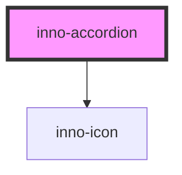

# inno-accordion 

import Tabs from '@theme/Tabs';
import TabItem from '@theme/TabItem';
import {InnoAccordion} from '@innomotics/ix-react-lib';

<Tabs>
  <TabItem value="preview" label="Preview" default>
    <InnoAccordion variant='light' label="Title">Text</InnoAccordion>
    <InnoAccordion variant='light' label="Title2" collapsed>Text</InnoAccordion>
    <InnoAccordion variant='dark' label="Title">Text</InnoAccordion>
    <InnoAccordion variant='dark' label="Title2" collapsed>Text</InnoAccordion>  
  </TabItem>
  <TabItem value="Angular" label="Angular">
    ```js
    <inno-accordion variant="light" label="Title">Text</inno-accordion>
    <inno-accordion variant="light" label="Title2" collapsed>Text</inno-accordion>
    <inno-accordion variant="dark" label="Title">Text</inno-accordion>
    <inno-accordion variant="dark" label="Title2" collapsed>Text</inno-accordion>  
    ```
  </TabItem>
  <TabItem value="React" label="React">
    ```js
    <InnoAccordion variant='light' label="Title">Text</InnoAccordion>
    <InnoAccordion variant='light' label="Title2" collapsed>Text</InnoAccordion>
    <InnoAccordion variant='dark' label="Title">Text</InnoAccordion>
    <InnoAccordion variant='dark' label="Title2" collapsed>Text</InnoAccordion>  
    ```
  </TabItem>
  <TabItem value="Vue" label="Vue">
    ```js
    <InnoAccordion variant='light' label="Title">Text</InnoAccordion>
    <InnoAccordion variant='light' label="Title2" collapsed>Text</InnoAccordion>
    <InnoAccordion variant='dark' label="Title">Text</InnoAccordion>
    <InnoAccordion variant='dark' label="Title2" collapsed>Text</InnoAccordion>    
    ```
  </TabItem>
</Tabs> 


<!-- Auto Generated Below -->


## Properties

| Property    | Attribute   | Description | Type                | Default     |
| ----------- | ----------- | ----------- | ------------------- | ----------- |
| `collapsed` | `collapsed` |             | `boolean`           | `false`     |
| `icon`      | `icon`      |             | `string`            | `undefined` |
| `inner`     | `inner`     |             | `boolean`           | `false`     |
| `label`     | `label`     |             | `string`            | `undefined` |
| `last`      | `last`      |             | `boolean`           | `false`     |
| `variant`   | `variant`   |             | `"dark" \| "light"` | `'light'`   |


## Events

| Event              | Description                                                  | Type                                                                      |
| ------------------ | ------------------------------------------------------------ | ------------------------------------------------------------------------- |
| `collapsedChanged` | This event is fired whenever the accordion is opened/closed. | `CustomEvent<{ element: HTMLInnoAccordionElement; collapsed: boolean; }>` |


## Dependencies

### Depends on

- [inno-icon](../inno-icon)

### Graph


----------------------------------------------

*Built with [StencilJS](https://stenciljs.com/)*
