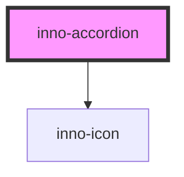

# inno-accordion

import Tabs from '@theme/Tabs';
import TabItem from '@theme/TabItem';
import {InnoAccordion} from '@innomotics/ix-react-lib';

<Tabs>
  <TabItem value="preview" label="Preview" default>
    <div class="component-display columns">
      <div class="light-bg">
        <span class="bg-title">light background</span>
        <InnoAccordion variant='light' label="Title">Text</InnoAccordion>
        <InnoAccordion variant='light' label="Title2" collapsed>Text</InnoAccordion>
      </div>
      <div class="dark-bg">
        <span class="bg-title">dark background</span>
        <InnoAccordion variant='dark' label="Title">Text</InnoAccordion>
        <InnoAccordion variant='dark' label="Title2" collapsed>Text</InnoAccordion>  
      </div>
    </div>
  </TabItem>
  <TabItem value="Angular" label="Angular">
    ```tsx
    <div class="component-display">
      <div class="light-bg">
        <span class="bg-title">light background</span>
        <inno-accordion variant='light' label="Title">Text</inno-accordion>
        <inno-accordion variant='light' label="Title2" collapsed>Text</inno-accordion>
      </div>
      <div class="dark-bg">
        <span class="bg-title">dark background</span>
        <inno-accordion variant='dark' label="Title">Text</inno-accordion>
        <inno-accordion variant='dark' label="Title2" collapsed>Text</inno-accordion>  
      </div>
    </div>  
    ```
  </TabItem>
  <TabItem value="React" label="React">
    ```tsx
     <div class="component-display">
      <div class="light-bg">
        <span class="bg-title">light background</span>
        <InnoAccordion variant='light' label="Title">Text</InnoAccordion>
        <InnoAccordion variant='light' label="Title2" collapsed>Text</InnoAccordion>
      </div>
      <div class="dark-bg">
        <span class="bg-title">dark background</span>
        <InnoAccordion variant='dark' label="Title">Text</InnoAccordion>
        <InnoAccordion variant='dark' label="Title2" collapsed>Text</InnoAccordion>  
      </div>
    </div>
    ```
  </TabItem>
  <TabItem value="Vue" label="Vue">
    ```tsx
     <div class="component-display">
      <div class="light-bg">
        <span class="bg-title">light background</span>
        <InnoAccordion variant='light' label="Title">Text</InnoAccordion>
        <InnoAccordion variant='light' label="Title2" collapsed>Text</InnoAccordion>
      </div>
      <div class="dark-bg">
        <span class="bg-title">dark background</span>
        <InnoAccordion variant='dark' label="Title">Text</InnoAccordion>
        <InnoAccordion variant='dark' label="Title2" collapsed>Text</InnoAccordion>  
      </div>
    </div>    
    ```
  </TabItem>
</Tabs>

<!-- Auto Generated Below -->


## Properties

| Property    | Attribute   | Description                                                                                     | Type                | Default     |
| ----------- | ----------- | ----------------------------------------------------------------------------------------------- | ------------------- | ----------- |
| `collapsed` | `collapsed` | You can programatically open/close the accordion with this property.                            | `boolean`           | `false`     |
| `inner`     | `inner`     | Whether it is an accordion inside another accordion. Gives a different style then the main one. | `boolean`           | `false`     |
| `label`     | `label`     | Text to display for the accordion. Always visible whether the accordion is opened or closed.    | `string`            | `undefined` |
| `last`      | `last`      | Whether the accordion is the last in a group of accordions. Needed for styling.                 | `boolean`           | `false`     |
| `variant`   | `variant`   | Color variant of the accordion.                                                                 | `"dark" \| "light"` | `'light'`   |


## Events

| Event              | Description                                                                       | Type                                                                      |
| ------------------ | --------------------------------------------------------------------------------- | ------------------------------------------------------------------------- |
| `collapsedChanged` | This event is fired whenever the accordion is opened/closed via user interaction. | `CustomEvent<{ element: HTMLInnoAccordionElement; collapsed: boolean; }>` |


## Dependencies

### Depends on

- [inno-icon](../inno-icon)

### Graph


----------------------------------------------

*Built with [StencilJS](https://stenciljs.com/)*
