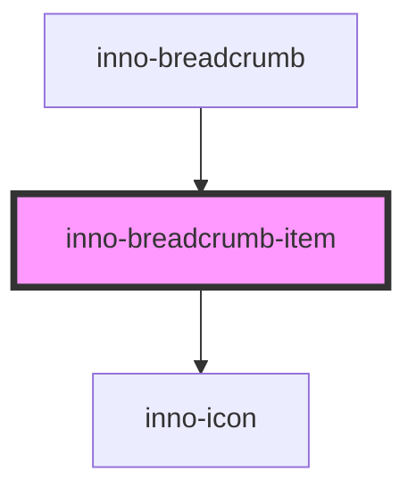

# inno-breadcrumb-item

<!-- Auto Generated Below -->

## Properties

| Property   | Attribute   | Description                            | Type     | Default     |
| ---------- | ----------- | -------------------------------------- | -------- | ----------- |
| `icon`     | `icon`      | Icon to be displayed next ot the label | `string` | `undefined` |
| `iconSize` | `icon-size` |                                        | `number` | `16`        |
| `label`    | `label`     | Breadcrumb label                       | `string` | `undefined` |

## Dependencies

### Used by

 - [inno-breadcrumb](..)

### Depends on

- [inno-icon](../../inno-icon)

### Graph

----------------------------------------------

*Built with [StencilJS](https://stenciljs.com/)*
