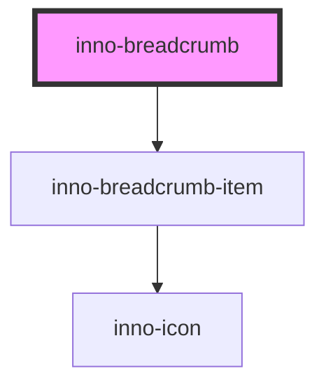

# inno-breadcrumb

<!-- Auto Generated Below -->

## Events

| Event       | Description              | Type                  |
| ----------- | ------------------------ | --------------------- |
| `itemClick` | Crumb item clicked event | `CustomEvent<string>` |

## Dependencies

### Depends on

- [inno-breadcrumb-item](../inno-breadcrumb-item)

### Graph

----------------------------------------------

*Built with [StencilJS](https://stenciljs.com/)*
