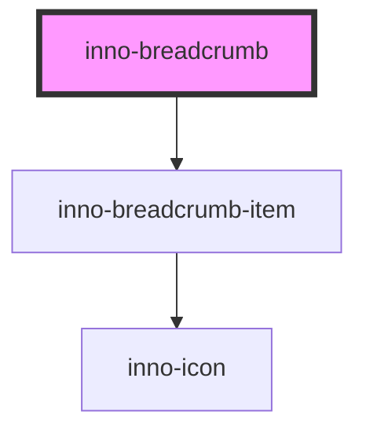

# inno-breadcrumb

import Tabs from '@theme/Tabs';
import TabItem from '@theme/TabItem';
import {InnoBreadcrumb, InnoBreadcrumbItem} from '@innomotics/ix-react-lib';

<Tabs>
  <TabItem value="preview" label="Preview" default>
    <InnoBreadcrumb>
      <InnoBreadcrumbItem label="One"></InnoBreadcrumbItem>
      <InnoBreadcrumbItem label="two"></InnoBreadcrumbItem>
    </InnoBreadcrumb>
  </TabItem>
  <TabItem value="Angular" label="Angular">
    ```js
    <inno-breadcrumb>
      <inno-breadcrumb-item label="One"></inno-breadcrumb-item>
      <inno-breadcrumb-item label="two"></inno-breadcrumb-item>
    </inno-breadcrumb>    
    ```
  </TabItem>
  <TabItem value="React" label="React">
    ```js
    <InnoBreadcrumb>
      <InnoBreadcrumbItem label="One"></InnoBreadcrumbItem>
      <InnoBreadcrumbItem label="two"></InnoBreadcrumbItem>
    </InnoBreadcrumb>
    ```
  </TabItem>
    <TabItem value="Vue" label="Vue">
    ```js
    <InnoBreadcrumb>
      <InnoBreadcrumbItem label="One"></InnoBreadcrumbItem>
      <InnoBreadcrumbItem label="two"></InnoBreadcrumbItem>
    </InnoBreadcrumb>
    ```
  </TabItem>
</Tabs>

<!-- Auto Generated Below -->


## Events

| Event       | Description                                                                                                                   | Type                                                 |
| ----------- | ----------------------------------------------------------------------------------------------------------------------------- | ---------------------------------------------------- |
| `itemClick` | Crumb item clicked event. The event contains the label and the zero-based index of the breadcrumb item inside the breadcrumb. | `CustomEvent<{ itemIndex: number; label: string; }>` |


## Dependencies

### Depends on

- [inno-breadcrumb-item](../inno-breadcrumb-item)

### Graph


----------------------------------------------

*Built with [StencilJS](https://stenciljs.com/)*
