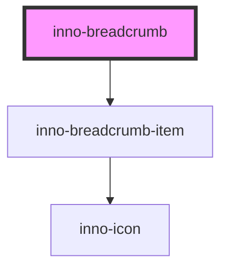

# inno-breadcrumb

import Tabs from '@theme/Tabs';
import TabItem from '@theme/TabItem';
import {InnoBreadcrumb, InnoBreadcrumbItem} from '@innomotics/brand-experience-react-lib';

<Tabs>
  <TabItem value="preview" label="Preview" default>
   <div class="component-display">
      <div class="light-bg">
        <span class="bg-title">light background</span>
        <InnoBreadcrumb>
          <InnoBreadcrumbItem label="One"></InnoBreadcrumbItem>
          <InnoBreadcrumbItem label="two"></InnoBreadcrumbItem>
        </InnoBreadcrumb>
      </div>
      <div class="dark-bg">
        <span class="bg-title">dark background</span>
        <InnoBreadcrumb variant="dark">
          <InnoBreadcrumbItem label="One"></InnoBreadcrumbItem>
          <InnoBreadcrumbItem label="two"></InnoBreadcrumbItem>
        </InnoBreadcrumb>
      </div>
    </div>
  </TabItem>
  <TabItem value="Angular" label="Angular">
    ```js
    <div class="component-display">
      <div class="light-bg">
        <span class="bg-title">light background</span>
        <InnoBreadcrumb>
          <InnoBreadcrumbItem label="One"></InnoBreadcrumbItem>
          <InnoBreadcrumbItem label="two"></InnoBreadcrumbItem>
        </InnoBreadcrumb>
      </div>
      <div class="dark-bg">
        <span class="bg-title">dark background</span>
        <InnoBreadcrumb variant="dark">
          <InnoBreadcrumbItem label="One"></InnoBreadcrumbItem>
          <InnoBreadcrumbItem label="two"></InnoBreadcrumbItem>
        </InnoBreadcrumb>
      </div>
    </div>   
    ```
  </TabItem>
  <TabItem value="React" label="React">
    ```tsx
    <div class="component-display">
      <div class="light-bg">
        <span class="bg-title">light background</span>
        <inno-breadcrumb>
          <inno-breadcrumb-item label="One"></inno-breadcrumb-item>
          <inno-breadcrumb-item label="two"></inno-breadcrumb-item>
        </inno-breadcrumb>
      </div>
      <div class="dark-bg">
        <span class="bg-title">dark background</span>
        <inno-breadcrumb variant="dark">
          <inno-breadcrumb-item label="One"></inno-breadcrumb-item>
          <inno-breadcrumb-item label="two"></inno-breadcrumb-item>
        </inno-breadcrumb>
      </div>
    </div>
    ```
  </TabItem>
    <TabItem value="Vue" label="Vue">
    ```tsx
    <div class="component-display">
      <div class="light-bg">
        <span class="bg-title">light background</span>
        <InnoBreadcrumb>
          <InnoBreadcrumbItem label="One"></InnoBreadcrumbItem>
          <InnoBreadcrumbItem label="two"></InnoBreadcrumbItem>
        </InnoBreadcrumb>
      </div>
      <div class="dark-bg">
        <span class="bg-title">dark background</span>
        <InnoBreadcrumb variant="dark">
          <InnoBreadcrumbItem label="One"></InnoBreadcrumbItem>
          <InnoBreadcrumbItem label="two"></InnoBreadcrumbItem>
        </InnoBreadcrumb>
      </div>
    </div>
    ```
  </TabItem>
</Tabs>

<!-- Auto Generated Below -->


## Properties

| Property  | Attribute | Description                     | Type                | Default   |
| --------- | --------- | ------------------------------- | ------------------- | --------- |
| `variant` | `variant` | Color variant of the accordion. | `"dark" \| "light"` | `'light'` |


## Events

| Event       | Description                                                                                                                   | Type                                                 |
| ----------- | ----------------------------------------------------------------------------------------------------------------------------- | ---------------------------------------------------- |
| `itemClick` | Crumb item clicked event. The event contains the label and the zero-based index of the breadcrumb item inside the breadcrumb. | `CustomEvent<{ itemIndex: number; label: string; }>` |


## Dependencies

### Depends on

- [inno-breadcrumb-item](../inno-breadcrumb-item)

### Graph


----------------------------------------------

*Built with [StencilJS](https://stenciljs.com/)*
