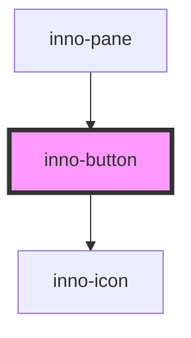

# inno-button

import Tabs from '@theme/Tabs';
import TabItem from '@theme/TabItem';
import {InnoButton} from '@innomotics/ix-react-lib';

<Tabs>
  <TabItem value="preview" label="Preview" default>
    <InnoButton variant="primary">Button</InnoButton>
  </TabItem>
  <TabItem value="Angular" label="Angular">
    ```js
    <inno-button variant="primary">Button</inno-button>
    ```
  </TabItem>
  <TabItem value="React" label="React">
    ```js
     <InnoButton variant="primary">Button</InnoButton>
    ```
  </TabItem>
    <TabItem value="Vue" label="Vue">
    ```js
     <InnoButton variant="primary">Button</InnoButton>
    ```
  </TabItem>
</Tabs>


<!-- Auto Generated Below -->


## Properties

| Property                | Attribute                 | Description | Type                                                                | Default     |
| ----------------------- | ------------------------- | ----------- | ------------------------------------------------------------------- | ----------- |
| `disabled`              | `disabled`                |             | `boolean`                                                           | `false`     |
| `icon`                  | `icon`                    |             | `string`                                                            | `undefined` |
| `iconOnly`              | `icon-only`               |             | `boolean`                                                           | `false`     |
| `iconPosition`          | `icon-position`           |             | `"left" \| "right"`                                                 | `'right'`   |
| `navDirection`          | `nav-direction`           |             | `"left" \| "right"`                                                 | `'right'`   |
| `parentBackgroundColor` | `parent-background-color` |             | `"dark" \| "light"`                                                 | `'light'`   |
| `tabIdx`                | `tab-idx`                 |             | `number`                                                            | `0`         |
| `type`                  | `type`                    |             | `"button" \| "submit"`                                              | `'button'`  |
| `variant`               | `variant`                 |             | `"media" \| "navigation" \| "primary" \| "secondary" \| "tertiary"` | `'primary'` |


## Dependencies

### Used by

 - [inno-pane](../inno-pane)

### Depends on

- [inno-icon](../inno-icon)

### Graph


----------------------------------------------

*Built with [StencilJS](https://stenciljs.com/)*
