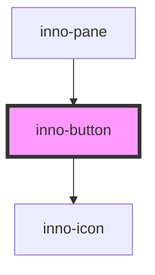

# inno-button

import Tabs from '@theme/Tabs';
import TabItem from '@theme/TabItem';
import {InnoButton} from '@innomotics/brand-experience-react-lib';

<Tabs>
  <TabItem value="preview" label="Preview" default>
          <div>
        <h1>regular buttons</h1>
        <div class="component-display">
          <div class="light-bg">
            <span class="bg-title">light background</span>
            <inno-button variant="primary" icon="arrow-right" color-variant="dark">primary button</inno-button>
            <inno-button variant="secondary" icon="arrow-right" color-variant="dark">secondary button</inno-button>
            <inno-button variant="tertiary" icon="arrow-right" color-variant="dark">tertiary button</inno-button>
            <inno-button variant="primary" icon="arrow-right" icon-only="true" color-variant="dark"></inno-button>
            <inno-button variant="secondary" icon="arrow-right" icon-only="true" color-variant="dark"></inno-button>
            <inno-button variant="tertiary" icon="arrow-right" icon-only="true" color-variant="dark"></inno-button>
          </div>
          <div class="dark-bg">
            <span class="bg-title">dark background</span>
            <inno-button variant="primary" icon="arrow-right">primary button</inno-button>
            <inno-button variant="secondary" icon="arrow-right">secondary button</inno-button>
            <inno-button variant="tertiary" icon="arrow-right">tertiary button</inno-button>
            <inno-button variant="primary" icon="arrow-right" icon-only="true"></inno-button>
            <inno-button variant="secondary" icon="arrow-right" icon-only="true"></inno-button>
            <inno-button variant="tertiary" icon="arrow-right" icon-only="true"></inno-button>
          </div>
          <div class="light-bg">
            <span class="bg-title">disabled light background</span>
            <inno-button variant="primary" disabled icon="arrowdoubleleft" icon-position="left" color-variant="dark">primary button</inno-button>
            <inno-button variant="secondary" disabled icon="arrowdoubleleft" icon-position="left" color-variant="dark">secondary button</inno-button>
            <inno-button variant="tertiary" disabled icon="arrowdoubleleft" icon-position="left" color-variant="dark">tertiary button</inno-button>
            <inno-button variant="primary" disabled icon="arrowdoubleleft" icon-only="true" color-variant="dark"></inno-button>
            <inno-button variant="secondary" disabled icon="arrowdoubleleft" icon-only="true" color-variant="dark"></inno-button>
            <inno-button variant="tertiary" disabled icon="arrowdoubleleft" icon-only="true" color-variant="dark"></inno-button>
          </div>
          <div class="dark-bg">
            <span class="bg-title">disabled dark background</span>
            <inno-button variant="primary" disabled icon="arrowdoubleleft" icon-position="left">primary button</inno-button>
            <inno-button variant="secondary" disabled icon="arrowdoubleleft" icon-position="left">secondary button</inno-button>
            <inno-button variant="tertiary" disabled icon="arrowdoubleleft" icon-position="left">tertiary button</inno-button>
            <inno-button variant="primary" disabled icon="arrowdoubleleft" icon-only="true"></inno-button>
            <inno-button variant="secondary" disabled icon="arrowdoubleleft" icon-only="true"></inno-button>
            <inno-button variant="tertiary" disabled icon="arrowdoubleleft" icon-only="true"></inno-button>
          </div>
        </div>
        <h1>media buttons</h1>
        <div style={{"display": "flex", "flex-direction": "row", "gap": "40px"}}>
          <inno-button variant="media" icon="share"></inno-button>
          <inno-button variant="media" icon="pause" disabled></inno-button>
        </div>
        <h1>navigation buttons</h1>
        <div style={{"display": "flex", "flex-direction": "row", "gap": "40px"}}>
          <inno-button variant="navigation" nav-direction="left"></inno-button>
          <inno-button variant="navigation" disabled></inno-button>
        </div>
      </div>
  </TabItem>
  <TabItem value="Angular" label="Angular">
    ```js
    <h1>regular buttons</h1>
        <div style={{"display": "flex", "flex-direction": "row"}}>
          <div style={{"background-color": "white", "padding": "15px"}}>
            <span class="bg-title" style={{"display": "block", "margin-bottom": "25px", "color": "black"}}>light background</span>
            <inno-button variant="primary" icon="arrow-right" color-variant="dark">primary button</inno-button>
            <inno-button variant="secondary" icon="arrow-right" color-variant="dark">secondary button</inno-button>
            <inno-button variant="tertiary" icon="arrow-right" color-variant="dark">tertiary button</inno-button>
            <inno-button variant="primary" icon="arrow-right" icon-only="true" color-variant="dark"></inno-button>
            <inno-button variant="secondary" icon="arrow-right" icon-only="true" color-variant="dark"></inno-button>
            <inno-button variant="tertiary" icon="arrow-right" icon-only="true" color-variant="dark"></inno-button>
          </div>
          <div style={{"background-color": "#08191f", "padding": "15px"}}>
            <span class="bg-title" style={{"display": "block", "margin-bottom": "25px", "color": "white"}}>dark background</span>
            <inno-button variant="primary" icon="arrow-right">primary button</inno-button>
            <inno-button variant="secondary" icon="arrow-right">secondary button</inno-button>
            <inno-button variant="tertiary" icon="arrow-right">tertiary button</inno-button>
            <inno-button variant="primary" icon="arrow-right" icon-only="true"></inno-button>
            <inno-button variant="secondary" icon="arrow-right" icon-only="true"></inno-button>
            <inno-button variant="tertiary" icon="arrow-right" icon-only="true"></inno-button>
          </div>
          <div style={{"background-color": "white", "padding": "15px"}}>
            <span class="bg-title" style={{"display": "block", "margin-bottom": "25px", "color": "black"}}>disabled light background</span>
            <inno-button variant="primary" disabled icon="arrowdoubleleft" icon-position="left" color-variant="dark">primary button</inno-button>
            <inno-button variant="secondary" disabled icon="arrowdoubleleft" icon-position="left" color-variant="dark">secondary button</inno-button>
            <inno-button variant="tertiary" disabled icon="arrowdoubleleft" icon-position="left" color-variant="dark">tertiary button</inno-button>
            <inno-button variant="primary" disabled icon="arrowdoubleleft" icon-only="true" color-variant="dark"></inno-button>
            <inno-button variant="secondary" disabled icon="arrowdoubleleft" icon-only="true" color-variant="dark"></inno-button>
            <inno-button variant="tertiary" disabled icon="arrowdoubleleft" icon-only="true" color-variant="dark"></inno-button>
          </div>
          <div style={{"background-color": "#08191f", "padding": "15px"}}>
            <span class="bg-title" style={{"display": "block", "margin-bottom": "25px", "color": "white"}}>disabled dark background</span>
            <inno-button variant="primary" disabled icon="arrowdoubleleft" icon-position="left">primary button</inno-button>
            <inno-button variant="secondary" disabled icon="arrowdoubleleft" icon-position="left">secondary button</inno-button>
            <inno-button variant="tertiary" disabled icon="arrowdoubleleft" icon-position="left">tertiary button</inno-button>
            <inno-button variant="primary" disabled icon="arrowdoubleleft" icon-only="true"></inno-button>
            <inno-button variant="secondary" disabled icon="arrowdoubleleft" icon-only="true"></inno-button>
            <inno-button variant="tertiary" disabled icon="arrowdoubleleft" icon-only="true"></inno-button>
          </div>
        </div>
        <h1>media buttons</h1>
        <div style={{"display": "flex", "flex-direction": "row", "gap": "40px"}}>
          <inno-button variant="media" icon="share"></inno-button>
          <inno-button variant="media" icon="pause" disabled></inno-button>
        </div>
        <h1>navigation buttons</h1>
        <div style={{"display": "flex", "flex-direction": "row", "gap": "40px"}}>
          <inno-button variant="navigation" nav-direction="left"></inno-button>
          <inno-button variant="navigation" disabled></inno-button>
        </div>
      </div>
    ```
  </TabItem>
  <TabItem value="React" label="React">
    ```js
     <h1>regular buttons</h1>
        <div style={{"display": "flex", "flex-direction": "row"}}>
          <div style={{"background-color": "white", "padding": "15px"}}>
            <span class="bg-title" style={{"display": "block", "margin-bottom": "25px", "color": "black"}}>light background</span>
            <InnoButton variant="primary" icon="arrow-right" color-variant="dark">primary button</InnoButton>
            <InnoButton variant="secondary" icon="arrow-right" color-variant="dark">secondary button</InnoButton>
            <InnoButton variant="tertiary" icon="arrow-right" color-variant="dark">tertiary button</InnoButton>
            <InnoButton variant="primary" icon="arrow-right" icon-only="true" color-variant="dark"></InnoButton>
            <InnoButton variant="secondary" icon="arrow-right" icon-only="true" color-variant="dark"></InnoButton>
            <InnoButton variant="tertiary" icon="arrow-right" icon-only="true" color-variant="dark"></InnoButton>
          </div>
          <div style={{"background-color": "#08191f", "padding": "15px"}}>
            <span class="bg-title" style={{"display": "block", "margin-bottom": "25px", "color": "white"}}>dark background</span>
            <InnoButton variant="primary" icon="arrow-right">primary button</InnoButton>
            <InnoButton variant="secondary" icon="arrow-right">secondary button</InnoButton>
            <InnoButton variant="tertiary" icon="arrow-right">tertiary button</InnoButton>
            <InnoButton variant="primary" icon="arrow-right" icon-only="true"></InnoButton>
            <InnoButton variant="secondary" icon="arrow-right" icon-only="true"></InnoButton>
            <InnoButton variant="tertiary" icon="arrow-right" icon-only="true"></InnoButton>
          </div>
          <div style={{"background-color": "white", "padding": "15px"}}>
            <span class="bg-title" style={{"display": "block", "margin-bottom": "25px", "color": "black"}}>disabled light background</span>
            <InnoButton variant="primary" disabled icon="arrowdoubleleft" icon-position="left" color-variant="dark">primary button</InnoButton>
            <InnoButton variant="secondary" disabled icon="arrowdoubleleft" icon-position="left" color-variant="dark">secondary button</InnoButton>
            <InnoButton variant="tertiary" disabled icon="arrowdoubleleft" icon-position="left" color-variant="dark">tertiary button</InnoButton>
            <InnoButton variant="primary" disabled icon="arrowdoubleleft" icon-only="true" color-variant="dark"></InnoButton>
            <InnoButton variant="secondary" disabled icon="arrowdoubleleft" icon-only="true" color-variant="dark"></InnoButton>
            <InnoButton variant="tertiary" disabled icon="arrowdoubleleft" icon-only="true" color-variant="dark"></InnoButton>
          </div>
          <div style={{"background-color": "#08191f", "padding": "15px"}}>
            <span class="bg-title" style={{"display": "block", "margin-bottom": "25px", "color": "white"}}>disabled dark background</span>
            <InnoButton variant="primary" disabled icon="arrowdoubleleft" icon-position="left">primary button</InnoButton>
            <InnoButton variant="secondary" disabled icon="arrowdoubleleft" icon-position="left">secondary button</InnoButton>
            <InnoButton variant="tertiary" disabled icon="arrowdoubleleft" icon-position="left">tertiary button</InnoButton>
            <InnoButton variant="primary" disabled icon="arrowdoubleleft" icon-only="true"></InnoButton>
            <InnoButton variant="secondary" disabled icon="arrowdoubleleft" icon-only="true"></InnoButton>
            <InnoButton variant="tertiary" disabled icon="arrowdoubleleft" icon-only="true"></InnoButton>
          </div>
        </div>
        <h1>media buttons</h1>
        <div style={{"display": "flex", "flex-direction": "row", "gap": "40px"}}>
          <InnoButton variant="media" icon="share"></InnoButton>
          <InnoButton variant="media" icon="pause" disabled></InnoButton>
        </div>
        <h1>navigation buttons</h1>
        <div style={{"display": "flex", "flex-direction": "row", "gap": "40px"}}>
          <InnoButton variant="navigation" nav-direction="left"></InnoButton>
          <InnoButton variant="navigation" disabled></InnoButton>
        </div>
      </div>
    ```
  </TabItem>
    <TabItem value="Vue" label="Vue">
    ```js
          <h1>regular buttons</h1>
        <div style={{"display": "flex", "flex-direction": "row"}}>
          <div style={{"background-color": "white", "padding": "15px"}}>
            <span class="bg-title" style={{"display": "block", "margin-bottom": "25px", "color": "black"}}>light background</span>
            <InnoButton variant="primary" icon="arrow-right" color-variant="dark">primary button</InnoButton>
            <InnoButton variant="secondary" icon="arrow-right" color-variant="dark">secondary button</InnoButton>
            <InnoButton variant="tertiary" icon="arrow-right" color-variant="dark">tertiary button</InnoButton>
            <InnoButton variant="primary" icon="arrow-right" icon-only="true" color-variant="dark"></InnoButton>
            <InnoButton variant="secondary" icon="arrow-right" icon-only="true" color-variant="dark"></InnoButton>
            <InnoButton variant="tertiary" icon="arrow-right" icon-only="true" color-variant="dark"></InnoButton>
          </div>
          <div style={{"background-color": "#08191f", "padding": "15px"}}>
            <span class="bg-title" style={{"display": "block", "margin-bottom": "25px", "color": "white"}}>dark background</span>
            <InnoButton variant="primary" icon="arrow-right">primary button</InnoButton>
            <InnoButton variant="secondary" icon="arrow-right">secondary button</InnoButton>
            <InnoButton variant="tertiary" icon="arrow-right">tertiary button</InnoButton>
            <InnoButton variant="primary" icon="arrow-right" icon-only="true"></InnoButton>
            <InnoButton variant="secondary" icon="arrow-right" icon-only="true"></InnoButton>
            <InnoButton variant="tertiary" icon="arrow-right" icon-only="true"></InnoButton>
          </div>
          <div style={{"background-color": "white", "padding": "15px"}}>
            <span class="bg-title" style={{"display": "block", "margin-bottom": "25px", "color": "black"}}>disabled light background</span>
            <InnoButton variant="primary" disabled icon="arrowdoubleleft" icon-position="left" color-variant="dark">primary button</InnoButton>
            <InnoButton variant="secondary" disabled icon="arrowdoubleleft" icon-position="left" color-variant="dark">secondary button</InnoButton>
            <InnoButton variant="tertiary" disabled icon="arrowdoubleleft" icon-position="left" color-variant="dark">tertiary button</InnoButton>
            <InnoButton variant="primary" disabled icon="arrowdoubleleft" icon-only="true" color-variant="dark"></InnoButton>
            <InnoButton variant="secondary" disabled icon="arrowdoubleleft" icon-only="true" color-variant="dark"></InnoButton>
            <InnoButton variant="tertiary" disabled icon="arrowdoubleleft" icon-only="true" color-variant="dark"></InnoButton>
          </div>
          <div style={{"background-color": "#08191f", "padding": "15px"}}>
            <span class="bg-title" style={{"display": "block", "margin-bottom": "25px", "color": "white"}}>disabled dark background</span>
            <InnoButton variant="primary" disabled icon="arrowdoubleleft" icon-position="left">primary button</InnoButton>
            <InnoButton variant="secondary" disabled icon="arrowdoubleleft" icon-position="left">secondary button</InnoButton>
            <InnoButton variant="tertiary" disabled icon="arrowdoubleleft" icon-position="left">tertiary button</InnoButton>
            <InnoButton variant="primary" disabled icon="arrowdoubleleft" icon-only="true"></InnoButton>
            <InnoButton variant="secondary" disabled icon="arrowdoubleleft" icon-only="true"></InnoButton>
            <InnoButton variant="tertiary" disabled icon="arrowdoubleleft" icon-only="true"></InnoButton>
          </div>
        </div>
        <h1>media buttons</h1>
        <div style={{"display": "flex", "flex-direction": "row", "gap": "40px"}}>
          <InnoButton variant="media" icon="share"></InnoButton>
          <InnoButton variant="media" icon="pause" disabled></InnoButton>
        </div>
        <h1>navigation buttons</h1>
        <div style={{"display": "flex", "flex-direction": "row", "gap": "40px"}}>
          <InnoButton variant="navigation" nav-direction="left"></InnoButton>
          <InnoButton variant="navigation" disabled></InnoButton>
        </div>
      </div>
    ```
  </TabItem>
</Tabs>


<!-- Auto Generated Below -->


## Properties

| Property       | Attribute       | Description                                                                         | Type                                                                | Default     |
| -------------- | --------------- | ----------------------------------------------------------------------------------- | ------------------------------------------------------------------- | ----------- |
| `colorVariant` | `color-variant` | Color variant of the button.                                                        | `"dark" \| "light"`                                                 | `'light'`   |
| `disabled`     | `disabled`      | Whether the button is disabled or not.                                              | `boolean`                                                           | `false`     |
| `icon`         | `icon`          | Icon to use inside the button.                                                      | `string`                                                            | `undefined` |
| `iconOnly`     | `icon-only`     | Only show an icon.                                                                  | `boolean`                                                           | `false`     |
| `iconPosition` | `icon-position` | Where to put the icon relative to the text.                                         | `"left" \| "right"`                                                 | `'right'`   |
| `listType`     | `list-type`     | Special style for button lists.                                                     | `boolean`                                                           | `false`     |
| `navDirection` | `nav-direction` | Direction of the navigation button. Only has effect if the variant is 'navigation'. | `"left" \| "right"`                                                 | `'right'`   |
| `tabIdx`       | `tab-idx`       | Tab index of the button.                                                            | `number`                                                            | `0`         |
| `type`         | `type`          | Type of the button.                                                                 | `"button" \| "submit"`                                              | `'button'`  |
| `variant`      | `variant`       | Variant of the button.                                                              | `"media" \| "navigation" \| "primary" \| "secondary" \| "tertiary"` | `'primary'` |


## Dependencies

### Used by

 - [inno-pane](../inno-pane)

### Depends on

- [inno-icon](../inno-icon)

### Graph


----------------------------------------------

*Built with [StencilJS](https://stenciljs.com/)*
