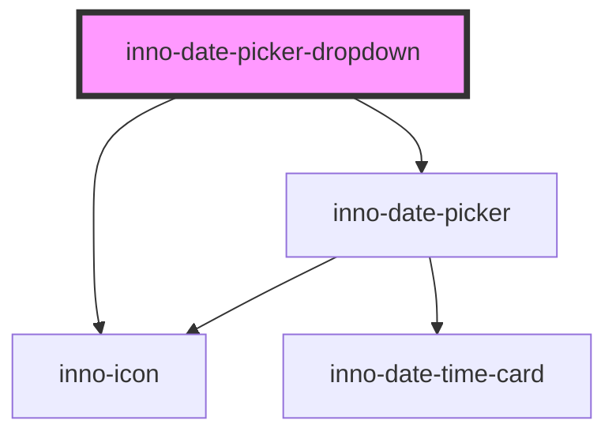

import Tabs from '@theme/Tabs';
import TabItem from '@theme/TabItem';
import {InnoDatePickerDropdown} from '@innomotics/brand-experience-react-lib';

# inno-date-picker-dropdown

<Tabs>
  <TabItem value="preview" label="Preview" default>
  <div class="component-display">
    <div class="light-bg component-display columns">
      <span class="bg-title">Light background</span>
      <InnoDatePickerDropdown></InnoDatePickerDropdown>
    </div>
  </div>

  <div class="component-display">
    <div class="dark-bg component-display columns">
      <span class="bg-title">Dark background</span>
      <InnoDatePickerDropdown></InnoDatePickerDropdown>
    </div>
  </div>
  </TabItem>
  <TabItem value="Angular" label="Angular">
    <div class="component-display">
    <div class="dark-bg">
      <span class="bg-title">Angular example</span>

      ```html
      <div>
        <inno-date-picker-dropdown></inno-date-picker-dropdown>
      </div>
      ```
    </div>
    </div>

  </TabItem>
  <TabItem value="React" label="React">
    <div class="component-display">
    <div class="dark-bg">
      <span class="bg-title">Inno date picker react</span>

      ```tsx
      export function InnoStatusMessageExample() {
        return (
          <>
            <InnoDatePickerDropdown></InnoDatePickerDropdown>
          </>
        );
      }
      ```
    </div>

  </div>
  </TabItem>
    <TabItem value="Vue" label="Vue">
    ```js
    <div class="component-display">
    <div class="light-bg">
      <span class="bg-title">light background</span>
    </div>
    <div class="dark-bg">
      <span class="bg-title">dark background</span>
    </div>
  </div>
    ```
  </TabItem>
</Tabs>

<!-- Auto Generated Below -->


## Properties

| Property   | Attribute | Description                           | Type                             | Default     |
| ---------- | --------- | ------------------------------------- | -------------------------------- | ----------- |
| `range`    | `range`   | If true a date-range can be selected. | `boolean`                        | `false`     |
| `settings` | --        |                                       | `InnoDatePickerDropdownSettings` | `undefined` |
| `variant`  | `variant` | Color variant of the component.       | `"dark" \| "light"`              | `'dark'`    |


## Dependencies

### Depends on

- [inno-icon](../inno-icon)
- [inno-date-picker](../inno-date-picker)

### Graph


----------------------------------------------

*Built with [StencilJS](https://stenciljs.com/)*
