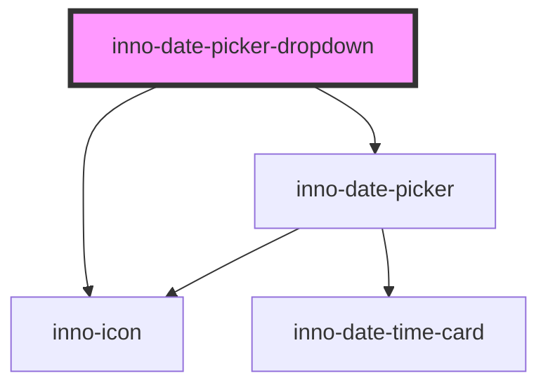

# inno-date-picker-dropdown

<!-- Auto Generated Below -->

## Properties

| Property   | Attribute | Description                           | Type                             | Default     |
| ---------- | --------- | ------------------------------------- | -------------------------------- | ----------- |
| `range`    | `range`   | If true a date-range can be selected. | `boolean`                        | `false`     |
| `settings` | --        |                                       | `InnoDatePickerDropdownSettings` | `undefined` |
| `variant`  | `variant` | Color variant of the component.       | `"dark" \| "light"`              | `'dark'`    |

## Dependencies

### Depends on

- [inno-icon](../inno-icon)
- [inno-date-picker](../inno-date-picker)

### Graph

----------------------------------------------

*Built with [StencilJS](https://stenciljs.com/)*
