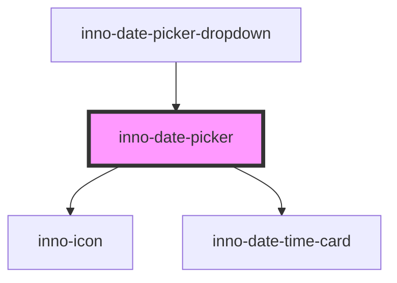

import Tabs from '@theme/Tabs';
import TabItem from '@theme/TabItem';
import {InnoDatePicker} from '@innomotics/brand-experience-react-lib';

# inno-date-picker

<Tabs>
  <TabItem value="preview" label="Preview" default>
  <div class="component-display">
    <div class="light-bg component-display columns">
      <span class="bg-title">Light background</span>
      <InnoDatePicker></InnoDatePicker>
    </div>
  </div>

  <div class="component-display">
    <div class="dark-bg component-display columns">
      <span class="bg-title">Dark background</span>
      <InnoDatePicker></InnoDatePicker>
    </div>
  </div>
  </TabItem>
  <TabItem value="Angular" label="Angular">
    <div class="component-display">
    <div class="dark-bg">
      <span class="bg-title">Component is usable as a normal Angular component.</span>

      ```html
      <div>
        <inno-date-picker [range]="true" (dateChange)="dateChange($event.detail)"></inno-date-picker>
      </div>
      ```

      ```ts
      @Component()
      export class ExampleComponent {
        dateChange(dateChange: DateChange) {
          // Use the date values
          const selectedDate = `${dateChange.from} - ${dateChange.to}`;
        }
      }

      ```

</div>
</div>

  </TabItem>
  <TabItem value="React" label="React">
    <div class="component-display">
    <div class="dark-bg">
      <span class="bg-title">Component is usable as a normal React component</span>

      ```tsx
      export default function InnoDatePickerExample() {
        const [selecedDate, changeDate] = useState<DateChange | undefined>(undefined);

        const handleDateChange = (event: CustomEvent<DateChange>) => {
          changeDate(event.detail);
        };

        return (
          <div>
            <InnoDatePicker
              range={true}
              onDateChange={(event) => handleDateChange(event)}
            ></InnoDatePicker>

            <span>Selectes value: </span>
            {`${selecedDate?.from} - ${selecedDate?.to}`}
          </div>
        );
      }

      ```
    </div>

  </div>
  </TabItem>
    <TabItem value="Vue" label="Vue">
    ```js
    <div class="component-display">
    <div class="light-bg">
      <span class="bg-title">light background</span>
    </div>
    <div class="dark-bg">
      <span class="bg-title">dark background</span>
    </div>
  </div>
    ```
  </TabItem>
</Tabs>

<!-- Auto Generated Below -->

## Overview

Innomotics date-picker.

## Properties

| Property         | Attribute          | Description                                                                                                                                                              | Type      | Default        |
| ---------------- | ------------------ | ------------------------------------------------------------------------------------------------------------------------------------------------------------------------ | --------- | -------------- |
| `format`         | `format`           | Date format string. See "https://moment.github.io/luxon/#/formatting?id=table-of-tokens" for all available tokens.                                                       | `string`  | `'yyyy/LL/dd'` |
| `from`           | `from`             | The selected starting date. If the date-picker is not in range mode this is the selected date. Format has to match the `format` property.                                | `string`  | `undefined`    |
| `i18nDone`       | `i18n-done`        | Text of date select button                                                                                                                                               | `string`  | `'Done'`       |
| `locale`         | `locale`           | Format of time string See "https://moment.github.io/luxon/#/formatting?id=table-of-tokens" for all available tokens.                                                     | `string`  | `undefined`    |
| `maxDate`        | `max-date`         | The latest date that can be selected by the date picker. If not set there will be no restriction.                                                                        | `string`  | `undefined`    |
| `minDate`        | `min-date`         | The earliest date that can be selected by the date picker. If not set there will be no restriction.                                                                      | `string`  | `undefined`    |
| `range`          | `range`            | If true a date-range can be selected (from/to).                                                                                                                          | `boolean` | `true`         |
| `to`             | `to`               | The selected end date. If the date-picker is not in range mode this property has no impact. Format has to match the `format` property.                                   | `string`  | `undefined`    |
| `weekStartIndex` | `week-start-index` | The index of which day to start the week on, based on the Locale#weekdays array. E.g. if the locale is en-us, weekStartIndex = 1 results in starting the week on monday. | `number`  | `0`            |

## Events

| Event        | Description                             | Type                                         |
| ------------ | --------------------------------------- | -------------------------------------------- |
| `dateChange` | Triggers if the date selection changes. | `CustomEvent<{ from: string; to: string; }>` |

## Methods

### `getCurrentDate() => Promise<{ from: string; to: string; }>`

Get the currently selected date-range.

#### Returns

Type: `Promise<{ from: string; to: string; }>`

## Dependencies

### Used by

- [inno-date-picker-dropdown](../inno-date-picker-dropdown)

### Depends on

- [inno-icon](../inno-icon)
- inno-date-time-card

### Graph



---

_Built with [StencilJS](https://stenciljs.com/)_
