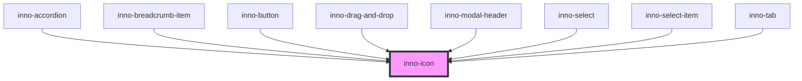

# inno-icon

import Tabs from '@theme/Tabs';
import TabItem from '@theme/TabItem';
import {InnoIcon} from '@innomotics/ix-react-lib';

<Tabs>
  <TabItem value="preview" label="Preview" default>
  <div class="component-display">
    <div class="light-bg">
      <span class="bg-title">light background</span>
      <InnoIcon icon='home' size='16' theme='light'></InnoIcon>
      <InnoIcon icon='home' size='24' theme='light'></InnoIcon>
      <InnoIcon icon='home' size='32' theme='light'></InnoIcon>
    </div>
    <div class="dark-bg">
      <span class="bg-title">dark background</span>
      <InnoIcon icon='home' size='16' theme='light'></InnoIcon>
      <InnoIcon icon='home' size='24' theme='light'></InnoIcon>
      <InnoIcon icon='home' size='32' theme='light'></InnoIcon>
    </div>
  </div>
  </TabItem>
  <TabItem value="Angular" label="Angular">
    ```js  
   <div class="component-display">
    <div class="light-bg">
      <span class="bg-title">light background</span>
      <inno-icon icon='home' size='16' theme='light'></inno-icon>
      <inno-icon icon='home' size='24' theme='light'></inno-icon>
      <inno-icon icon='home' size='32' theme='light'></inno-icon>
    </div>
    <div class="dark-bg">
      <span class="bg-title">dark background</span>
      <inno-icon icon='home' size='16' theme='light'></inno-icon>
      <inno-icon icon='home' size='24' theme='light'></inno-icon>
      <inno-icon icon='home' size='32' theme='light'></inno-icon>
    </div>
  </div>
    ```
  </TabItem>
  <TabItem value="React" label="React">
    ```js
  <div class="component-display">
    <div class="light-bg">
      <span class="bg-title">light background</span>
      <InnoIcon icon='home' size='16' theme='light'></InnoIcon>
      <InnoIcon icon='home' size='24' theme='light'></InnoIcon>
      <InnoIcon icon='home' size='32' theme='light'></InnoIcon>
    </div>
    <div class="dark-bg">
      <span class="bg-title">dark background</span>
      <InnoIcon icon='home' size='16' theme='light'></InnoIcon>
      <InnoIcon icon='home' size='24' theme='light'></InnoIcon>
      <InnoIcon icon='home' size='32' theme='light'></InnoIcon>
    </div>
  </div>
    ```
  </TabItem>
    <TabItem value="Vue" label="Vue">
    ```js
  <div class="component-display">
    <div class="light-bg">
      <span class="bg-title">light background</span>
      <InnoIcon icon='home' size='16' theme='light'></InnoIcon>
      <InnoIcon icon='home' size='24' theme='light'></InnoIcon>
      <InnoIcon icon='home' size='32' theme='light'></InnoIcon>
    </div>
    <div class="dark-bg">
      <span class="bg-title">dark background</span>
      <InnoIcon icon='home' size='16' theme='light'></InnoIcon>
      <InnoIcon icon='home' size='24' theme='light'></InnoIcon>
      <InnoIcon icon='home' size='32' theme='light'></InnoIcon>
    </div>
  </div>
    ```
  </TabItem>
</Tabs>

<!-- Auto Generated Below -->


## Properties

| Property  | Attribute | Description              | Type                | Default     |
| --------- | --------- | ------------------------ | ------------------- | ----------- |
| `icon`    | `icon`    | The icon name            | `string`            | `undefined` |
| `size`    | `size`    |                          | `number`            | `16`        |
| `variant` | `variant` | Color style of the icon. | `"dark" \| "light"` | `'light'`   |


## Dependencies

### Used by

 - [inno-accordion](../inno-accordion)
 - [inno-breadcrumb-item](../inno-breadcrumb-item)
 - [inno-button](../inno-button)
 - [inno-drag-and-drop](../inno-drag-and-drop)
 - [inno-modal-header](../inno-modal-header)
 - [inno-select](../inno-select)
 - [inno-select-item](../inno-select-item)
 - [inno-tab](../inno-tab)

### Graph


----------------------------------------------

*Built with [StencilJS](https://stenciljs.com/)*
