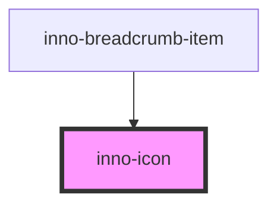

# inno-icon

<!-- Auto Generated Below -->

## Properties

| Property | Attribute | Description   | Type     | Default                |
| -------- | --------- | ------------- | -------- | ---------------------- |
| `icon`   | `icon`    | The icon name | `string` | `undefined`            |
| `size`   | `size`    |               | `number` | `12 \| 16 \| 24 \| 32` |

## Dependencies

### Used by

 - [inno-breadcrumb-item](../inno-breadcrumb-item)

### Graph

----------------------------------------------

*Built with [StencilJS](https://stenciljs.com/)*
