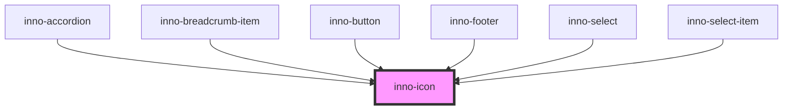

# inno-icon

<!-- Auto Generated Below -->

## Properties

| Property | Attribute | Description   | Type                | Default     |
| -------- | --------- | ------------- | ------------------- | ----------- |
| `icon`   | `icon`    | The icon name | `string`            | `undefined` |
| `size`   | `size`    |               | `number`            | `16`        |
| `theme`  | `theme`   |               | `"dark" \| "light"` | `'light'`   |

## Dependencies

### Used by

 - [inno-accordion](../inno-accordion)
 - [inno-breadcrumb-item](../inno-breadcrumb-item)
 - [inno-button](../inno-button)
 - [inno-footer](../inno-footer)
 - [inno-select](../inno-select)
 - [inno-select-item](../inno-select-item)

### Graph

----------------------------------------------

*Built with [StencilJS](https://stenciljs.com/)*
