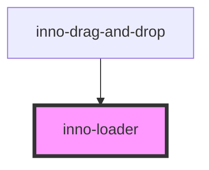

# inno-loader


import Tabs from '@theme/Tabs';
import TabItem from '@theme/TabItem';
import {InnoLoader} from '@innomotics/brand-experience-react-lib';

<Tabs>
  <TabItem value="preview" label="Preview" default>
  <div class="component-display">
    <div class="light-bg">
      <span class="bg-title">light background</span>
      <InnoLoader></InnoLoader>
    </div>
    <div class="dark-bg">
      <span class="bg-title">dark background</span>
      <InnoLoader variant="dark"></InnoLoader>
    </div>
  </div>
  </TabItem>
  <TabItem value="Angular" label="Angular">
    ```js
    div class="component-display">
    <div class="light-bg">
      <span class="bg-title">light background</span>
      <inno-loader></inno-loader>
    </div>
    <div class="dark-bg">
      <span class="bg-title">dark background</span>
      <inno-loader variant="dark"></inno-loader>
    </div>
  </div>
    ```
  </TabItem>
  <TabItem value="React" label="React">
    ```js
    div class="component-display">
    <div class="light-bg">
      <span class="bg-title">light background</span>
      <InnoLoader></InnoLoader>
    </div>
    <div class="dark-bg">
      <span class="bg-title">dark background</span>
      <InnoLoader variant="dark"></InnoLoader>
    </div>
  </div>
    ```
  </TabItem>
    <TabItem value="Vue" label="Vue">
    ```js
    div class="component-display">
    <div class="light-bg">
      <span class="bg-title">light background</span>
      <InnoLoader></InnoLoader>
    </div>
    <div class="dark-bg">
      <span class="bg-title">dark background</span>
      <InnoLoader variant="dark"></InnoLoader>
    </div>
  </div>
    ```
  </TabItem>
</Tabs>


<!-- Auto Generated Below -->


## Properties

| Property  | Attribute | Description                                           | Type                | Default   |
| --------- | --------- | ----------------------------------------------------- | ------------------- | --------- |
| `size`    | `size`    | Size of the loader. Valid values are: 16, 24, 32, 64. | `number`            | `64`      |
| `variant` | `variant` | Theme variant property.                               | `"dark" \| "light"` | `'light'` |


## Dependencies

### Used by

 - [inno-drag-and-drop](../inno-drag-and-drop)

### Graph


----------------------------------------------

*Built with [StencilJS](https://stenciljs.com/)*
