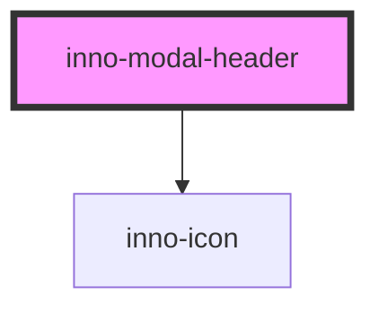

# inno-modal-header

<!-- Auto Generated Below -->

## Properties

| Property    | Attribute    | Description                     | Type                | Default     |
| ----------- | ------------ | ------------------------------- | ------------------- | ----------- |
| `icon`      | `icon`       | Icon of the Header              | `string`            | `undefined` |
| `showClose` | `show-close` | Hide the close button.          | `boolean`           | `true`      |
| `variant`   | `variant`    | Theme variant of the component. | `"dark" \| "light"` | `'light'`   |

## Events

| Event        | Description                                                                                                                                   | Type                 |
| ------------ | --------------------------------------------------------------------------------------------------------------------------------------------- | -------------------- |
| `closeClick` | Emits when close icon is clicked and closes the modal Can be prevented, in which case only the event is triggered, and the modal remains open | `CustomEvent<Event>` |

## Dependencies

### Depends on

- [inno-icon](../inno-icon)

### Graph

----------------------------------------------

*Built with [StencilJS](https://stenciljs.com/)*
