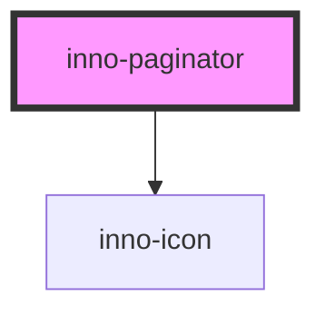

# inno-paginator

import Tabs from '@theme/Tabs';
import TabItem from '@theme/TabItem';
import {InnoIcon} from '@innomotics/ix-react-lib';

<Tabs>
  <TabItem value="preview" label="Preview" default>
  <div class="component-display">
    <div class="light-bg">
      <span class="bg-title">light background</span>
      <inno-paginator page-count="15"></inno-paginator>
    </div>
    <div class="dark-bg">
      <span class="bg-title">dark background</span>
      <inno-paginator page-count="15" variant="dark"></inno-paginator>
    </div>
  </div>
  </TabItem>
  <TabItem value="Angular" label="Angular">
    ```js  
   <div class="component-display">
    <div class="light-bg">
      <span class="bg-title">light background</span>
      <inno-paginator page-count="15"></inno-paginator>
    </div>
    <div class="dark-bg">
      <span class="bg-title">dark background</span>
      <inno-paginator page-count="15" variant="dark"></inno-paginator>
    </div>
  </div>
    ```
  </TabItem>
  <TabItem value="React" label="React">
    ```js
  <div class="component-display">
    <div class="light-bg">
      <span class="bg-title">light background</span>
      <InnoPaginator page-count="15"></InnoPaginator>
    </div>
    <div class="dark-bg">
      <span class="bg-title">dark background</span>
      <InnoPaginator page-count="15" variant="dark"></InnoPaginator>
    </div>
  </div>
    ```
  </TabItem>
    <TabItem value="Vue" label="Vue">
    ```js
    <div class="component-display">
    <div class="light-bg">
      <span class="bg-title">light background</span>
      <InnoPaginator page-count="15"></InnoPaginator>
    </div>
    <div class="dark-bg">
      <span class="bg-title">dark background</span>
      <InnoPaginator page-count="15" variant="dark"></InnoPaginator>
    </div>
  </div>

    ```
  </TabItem>
</Tabs>

<!-- Auto Generated Below -->


## Properties

| Property       | Attribute       | Description                                 | Type                | Default     |
| -------------- | --------------- | ------------------------------------------- | ------------------- | ----------- |
| `pageCount`    | `page-count`    | Total number of pages                       | `number`            | `undefined` |
| `selectedPage` | `selected-page` | Zero based index of currently selected page | `number`            | `0`         |
| `variant`      | `variant`       |                                             | `"dark" \| "light"` | `'light'`   |


## Events

| Event              | Description             | Type                  |
| ------------------ | ----------------------- | --------------------- |
| `itemCountChanged` | Item count change event | `CustomEvent<number>` |
| `pageSelected`     | Page selection event    | `CustomEvent<number>` |


## Dependencies

### Depends on

- [inno-icon](../inno-icon)

### Graph


----------------------------------------------

*Built with [StencilJS](https://stenciljs.com/)*
