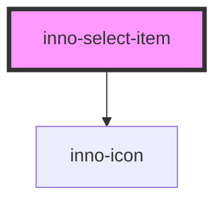

# inno-select-item

<!-- Auto Generated Below -->

## Properties

| Property   | Attribute  | Description                                         | Type      | Default     |
| ---------- | ---------- | --------------------------------------------------- | --------- | ----------- |
| `icon`     | `icon`     | Optional icon for the label.                        | `string`  | `undefined` |
| `label`    | `label`    | Label of the item, can be different from the value. | `string`  | `undefined` |
| `selected` | `selected` | Whether the item is selected or not.                | `boolean` | `false`     |
| `value`    | `value`    | Value of the item.                                  | `any`     | `undefined` |

## Events

| Event          | Description                                       | Type               |
| -------------- | ------------------------------------------------- | ------------------ |
| `itemSelected` | This event is fired whenever an item is selected. | `CustomEvent<any>` |

## Dependencies

### Depends on

- [inno-icon](../inno-icon)

### Graph

----------------------------------------------

*Built with [StencilJS](https://stenciljs.com/)*
