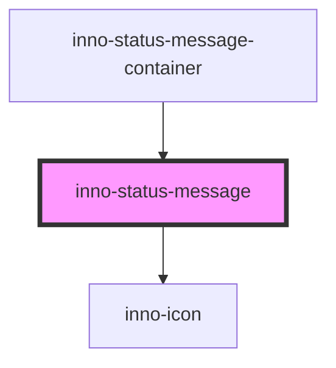

import Tabs from '@theme/Tabs';
import TabItem from '@theme/TabItem';
import {InnoStatusMessage} from '@innomotics/brand-experience-react-lib';
import InnoStatusMessageExample from '@site/src/components/InnoStatusMessageExample/InnoStatusMessageExample'

# inno-status-message

<Tabs>
  <TabItem value="preview" label="Preview" default>
  <div class="component-display">
    <div class="dark-bg component-display columns">
      <span class="bg-title">status message example</span>
      <InnoStatusMessageExample></InnoStatusMessageExample>
    </div>
  </div>

  <div class="component-display">
    <div class="light-bg component-display columns">
      <span class="bg-title">light background</span>
      <InnoStatusMessage theme="light" messageType="info"><span>Status message</span></InnoStatusMessage>
      <InnoStatusMessage theme="light" messageType="success"><span>Status message</span></InnoStatusMessage>
      <InnoStatusMessage theme="light" messageType="warning"><span>Status message</span></InnoStatusMessage>
      <InnoStatusMessage theme="light" messageType="error"><span>Status message</span></InnoStatusMessage>
    </div>
  </div>
  <div class="component-display">
    <div class="dark-bg component-display columns">
      <span class="bg-title">dark background</span>
      <InnoStatusMessage theme="dark" messageType="info" showProgess><span>Status message</span></InnoStatusMessage>
      <InnoStatusMessage theme="dark" messageType="success"><span>Status message</span></InnoStatusMessage>
      <InnoStatusMessage theme="dark" messageType="warning"><span>Status message</span></InnoStatusMessage>
      <InnoStatusMessage theme="dark" messageType="error"><span>Status message</span></InnoStatusMessage>
    </div>
  </div>
  </TabItem>
  <TabItem value="Angular" label="Angular">
    <div class="component-display">
    <div class="dark-bg">
      <span class="bg-title">Import the provided service to show status messages.</span>

      ```html
      <div>
        <inno-button (click)="showStatusMessage()">show status message</inno-button>
      </div>
      ```

      ```ts
      @Component({})
      export class GeneralComponent {
        constructor(private messageService: StatusMessageService) {}

        async showStatusMessage() {
          const ref = await this.messageService.show({
            message: 'my message',
            theme: 'dark',
            type: 'warning',
            position: 'top-left',
            autoClose: false,
            autoCloseDelay: 1000,
            showProgress: true,
          });

          // message can be closed explicitly, example timeout close
          setTimeout(() => ref.close('cause'), 2000);
        }
      }
      ```
    </div>
    </div>

  </TabItem>
  <TabItem value="React" label="React">
    <div class="component-display">
    <div class="dark-bg">
      <span class="bg-title">Use the provided function to show status message.</span>

      ```tsx
      export function InnoStatusMessageExample() {
        return (
          <>
            <InnoButton
              onClick={() => {
                showStatusMessage({
                  message: "My toast message!",
                  showProgress: true,
                  theme: "dark",
                  type: "success",
                });
              }}
            >
              Trigger status message
            </InnoButton>
          </>
        );
      }
      ```
    </div>

  </div>
  </TabItem>
    <TabItem value="Vue" label="Vue">
    ```js
    <div class="component-display">
    <div class="light-bg">
      <span class="bg-title">light background</span>
    </div>
    <div class="dark-bg">
      <span class="bg-title">dark background</span>
    </div>
  </div>
    ```
  </TabItem>
</Tabs>

<!-- Auto Generated Below -->


## Overview

Represents a status message entry.

## Properties

| Property         | Attribute          | Description                                                                                                           | Type                                          | Default     |
| ---------------- | ------------------ | --------------------------------------------------------------------------------------------------------------------- | --------------------------------------------- | ----------- |
| `autoClose`      | `auto-close`       | Autoclose message after the given delay. The message will be closed independently from showProgress property.         | `boolean`                                     | `false`     |
| `autoCloseDelay` | `auto-close-delay` | Autoclose delay.                                                                                                      | `number`                                      | `3000`      |
| `icon`           | `icon`             | Icon of toast                                                                                                         | `string`                                      | `undefined` |
| `iconColor`      | `icon-color`       | Icon color of toast                                                                                                   | `string`                                      | `undefined` |
| `messageType`    | `message-type`     | Type of the status message.                                                                                           | `"error" \| "info" \| "success" \| "warning"` | `'info'`    |
| `showProgress`   | `show-progress`    | Animate progressbar and close after animation ends. The message will be closed independently from autoClose property. | `boolean`                                     | `false`     |
| `theme`          | `theme`            | Theme variant of the component.                                                                                       | `"dark" \| "light"`                           | `'light'`   |


## Events

| Event          | Description               | Type               |
| -------------- | ------------------------- | ------------------ |
| `closeMessage` | Status message is closed. | `CustomEvent<any>` |


## Dependencies

### Used by

 - inno-status-message-container

### Depends on

- [inno-icon](../inno-icon)

### Graph


----------------------------------------------

*Built with [StencilJS](https://stenciljs.com/)*
