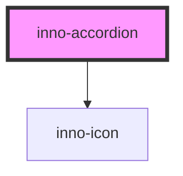

# inno-accordion

<!-- Auto Generated Below -->

## Properties

| Property    | Attribute   | Description | Type                | Default     |
| ----------- | ----------- | ----------- | ------------------- | ----------- |
| `collapsed` | `collapsed` |             | `boolean`           | `false`     |
| `icon`      | `icon`      |             | `string`            | `undefined` |
| `label`     | `label`     |             | `string`            | `undefined` |
| `variant`   | `variant`   |             | `"dark" \| "light"` | `'light'`   |

## Dependencies

### Depends on

- [inno-icon](../inno-icon)

### Graph

----------------------------------------------

*Built with [StencilJS](https://stenciljs.com/)*
