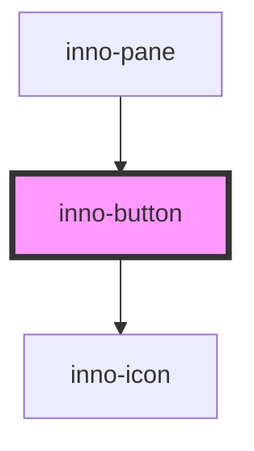

# inno-button

import Tabs from '@theme/Tabs';
import TabItem from '@theme/TabItem';
import {InnoButton} from '@innomotics/ix-react-lib';

<Tabs>
  <TabItem value="preview" label="Preview" default>
    <InnoButton variant="primary">Button</InnoButton>
  </TabItem>
  <TabItem value="Angular" label="Angular">
    ```js
    <inno-button variant="primary">Button</inno-button>
    ```
  </TabItem>
  <TabItem value="React" label="React">
    ```js
     <InnoButton variant="primary">Button</InnoButton>
    ```
  </TabItem>
    <TabItem value="Vue" label="Vue">
    ```js
     <InnoButton variant="primary">Button</InnoButton>
    ```
  </TabItem>
</Tabs>


<!-- Auto Generated Below -->


## Properties

| Property       | Attribute       | Description                                                                         | Type                                                                | Default     |
| -------------- | --------------- | ----------------------------------------------------------------------------------- | ------------------------------------------------------------------- | ----------- |
| `colorVariant` | `color-variant` | Color variant of the button.                                                        | `"dark" \| "light"`                                                 | `'light'`   |
| `disabled`     | `disabled`      | Whether the button is disabled or not.                                              | `boolean`                                                           | `false`     |
| `icon`         | `icon`          | Icon to use inside the button.                                                      | `string`                                                            | `undefined` |
| `iconOnly`     | `icon-only`     | Only show an icon.                                                                  | `boolean`                                                           | `false`     |
| `iconPosition` | `icon-position` | Where to put the icon relative to the text.                                         | `"left" \| "right"`                                                 | `'right'`   |
| `listType`     | `list-type`     | Special style for button lists.                                                     | `boolean`                                                           | `false`     |
| `navDirection` | `nav-direction` | Direction of the navigation button. Only has effect if the variant is 'navigation'. | `"left" \| "right"`                                                 | `'right'`   |
| `tabIdx`       | `tab-idx`       | Tab index of the button.                                                            | `number`                                                            | `0`         |
| `type`         | `type`          | Type of the button.                                                                 | `"button" \| "submit"`                                              | `'button'`  |
| `variant`      | `variant`       | Variant of the button.                                                              | `"media" \| "navigation" \| "primary" \| "secondary" \| "tertiary"` | `'primary'` |


## Dependencies

### Used by

 - [inno-pane](../inno-pane)

### Depends on

- [inno-icon](../inno-icon)

### Graph


----------------------------------------------

*Built with [StencilJS](https://stenciljs.com/)*
