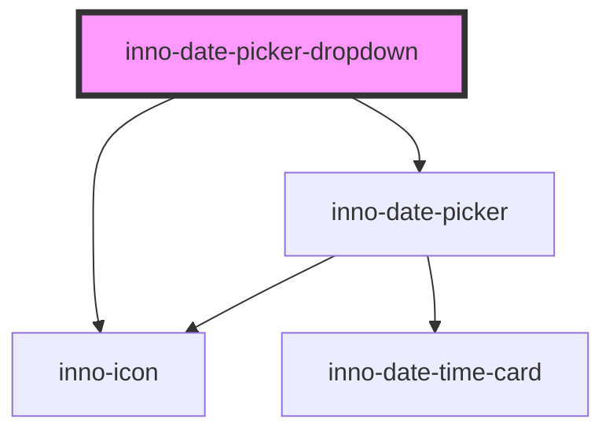

import Tabs from '@theme/Tabs';
import TabItem from '@theme/TabItem';
import {InnoDatePickerDropdown} from '@innomotics/brand-experience-react-lib';

# inno-date-picker-dropdown

<Tabs>
  <TabItem value="preview" label="Preview" default>
  <div class="component-display">
    <div class="light-bg component-display columns">
      <span class="bg-title">Light background</span>
      <InnoDatePickerDropdown variant="light"></InnoDatePickerDropdown>
    </div>
  </div>

  <div class="component-display">
    <div class="dark-bg component-display columns">
      <span class="bg-title">Dark background</span>
      <InnoDatePickerDropdown></InnoDatePickerDropdown>
    </div>
  </div>
  </TabItem>
  <TabItem value="Angular" label="Angular">
    <div class="component-display">
    <div class="dark-bg">
      <span class="bg-title">Angular example</span>

      ```html
      <div>
        <inno-date-picker-dropdown></inno-date-picker-dropdown>
      </div>
      ```
    </div>
    </div>

  </TabItem>
  <TabItem value="React" label="React">
    <div class="component-display">
    <div class="dark-bg">
      <span class="bg-title">Inno date picker react</span>

      ```tsx
      export function InnoStatusMessageExample() {
        return (
          <>
            <InnoDatePickerDropdown></InnoDatePickerDropdown>
          </>
        );
      }
      ```
    </div>

  </div>
  </TabItem>
    <TabItem value="Vue" label="Vue">
    ```js
    <div class="component-display">
    <div class="light-bg">
      <span class="bg-title">light background</span>
    </div>
    <div class="dark-bg">
      <span class="bg-title">dark background</span>
    </div>
  </div>
    ```
  </TabItem>
</Tabs>

<!-- Auto Generated Below -->


## Overview

Date-picker with dropdown.

## Properties

| Property         | Attribute          | Description                                                                                                    | Type                | Default        |
| ---------------- | ------------------ | -------------------------------------------------------------------------------------------------------------- | ------------------- | -------------- |
| `format`         | `format`           | Date format string. See the date-picker component for more information.                                        | `string`            | `'yyyy/LL/dd'` |
| `from`           | `from`             | The selected starting range. See the date-picker component for more information.                               | `string`            | `undefined`    |
| `label`          | `label`            | Label of the dropdown component.                                                                               | `string`            | `undefined`    |
| `locale`         | `locale`           | Format of the date strings. See the date-picker component for more information.                                | `string`            | `undefined`    |
| `maxDate`        | `max-date`         | The latest date that can be selected by the date picker. See the date-picker component for more information.   | `string`            | `undefined`    |
| `minDate`        | `min-date`         | The earliest date that can be selected by the date picker. See the date-picker component for more information. | `string`            | `undefined`    |
| `range`          | `range`            | If true a date-range can be selected. See the date-picker component for more information.                      | `boolean`           | `false`        |
| `to`             | `to`               | The selected end date. See the date-picker component for more information.                                     | `string`            | `undefined`    |
| `variant`        | `variant`          | Color variant of the component.                                                                                | `"dark" \| "light"` | `'dark'`       |
| `weekStartIndex` | `week-start-index` | The index of which day to start the week on. See the date-picker component for more information.               | `number`            | `0`            |


## Events

| Event        | Description                             | Type                                         |
| ------------ | --------------------------------------- | -------------------------------------------- |
| `dateChange` | Triggers if the date selection changes. | `CustomEvent<{ from: string; to: string; }>` |


## Dependencies

### Depends on

- [inno-icon](../inno-icon)
- [inno-date-picker](../inno-date-picker)

### Graph


----------------------------------------------

*Built with [StencilJS](https://stenciljs.com/)*
