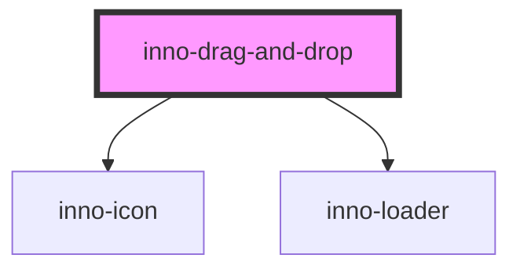

# inno-drag-and-drop

<!-- Auto Generated Below -->

## Properties

| Property   | Attribute  | Description                                                                                                                                                                                                                                                                                                                                                                                                                                                                                                                                                                                                        | Type                                                                                                                        | Default                                                                                                                                                                                                                                        |
| ---------- | ---------- | ------------------------------------------------------------------------------------------------------------------------------------------------------------------------------------------------------------------------------------------------------------------------------------------------------------------------------------------------------------------------------------------------------------------------------------------------------------------------------------------------------------------------------------------------------------------------------------------------------------------ | --------------------------------------------------------------------------------------------------------------------------- | ---------------------------------------------------------------------------------------------------------------------------------------------------------------------------------------------------------------------------------------------- |
| `accept`   | `accept`   | The accept attribute specifies the types of files that the server accepts (that can be submitted through a file upload). "https://www.w3schools.com/tags/att_input_accept.asp"                                                                                                                                                                                                                                                                                                                                                                                                                                     | `string`                                                                                                                    | `undefined`                                                                                                                                                                                                                                    |
| `disabled` | `disabled` | Disable all input events                                                                                                                                                                                                                                                                                                                                                                                                                                                                                                                                                                                           | `boolean`                                                                                                                   | `false`                                                                                                                                                                                                                                        |
| `multiple` | `multiple` | If multiple is true the user can drop or select multiple files                                                                                                                                                                                                                                                                                                                                                                                                                                                                                                                                                     | `boolean`                                                                                                                   | `false`                                                                                                                                                                                                                                        |
| `state`    | `state`    | After a file is uploaded you can set the upload component to a defined state                                                                                                                                                                                                                                                                                                                                                                                                                                                                                                                                       | `UploadFileState.LOADING \| UploadFileState.SELECT_FILE \| UploadFileState.UPLOAD_FAILED \| UploadFileState.UPLOAD_SUCCESS` | `UploadFileState.SELECT_FILE`                                                                                                                                                                                                                  |
| `texts`    | --         | 'firstLineText' and 'secondLineText': will be used by state = UploadFileState.SELECT_FILE, 'orText': The word 'or' or its equivalent translation. Hidden if only 'firstLineText' or only 'secondLineText' is used, 'dragText': displayed when file is dragged over the component, 'loadingText': will be used by state = UploadFileState.LOADING, 'uploadFailedText': will be used by state = UploadFileState.UPLOAD_FAILED, 'uploadSuccessText': will be used by state = UploadFileState.UPLOAD_SUCCESSED, 'acceptedFileTypesText': label for accepted file types, 'uploadDisabledText': label for disabled state | `DragAndDropTexts`                                                                                                          | `{     firstLineText: null,     secondLineText: null,     orText: null,     dragText: null,     loadingText: null,     uploadFailedText: null,     uploadSuccessText: null,     acceptedFileTypesText: null,     uploadDisabledText: null   }` |
| `variant`  | `variant`  | Color variant of the component.                                                                                                                                                                                                                                                                                                                                                                                                                                                                                                                                                                                    | `"dark" \| "light"`                                                                                                         | `'dark'`                                                                                                                                                                                                                                       |

## Events

| Event          | Description | Type                  |
| -------------- | ----------- | --------------------- |
| `filesChanged` |             | `CustomEvent<File[]>` |

## Methods

### `setFilesToUpload(obj: any) => Promise<void>`

#### Parameters

| Name  | Type  | Description |
| ----- | ----- | ----------- |
| `obj` | `any` |             |

#### Returns

Type: `Promise<void>`

## Dependencies

### Depends on

- [inno-icon](../inno-icon)
- [inno-loader](../inno-loader)

### Graph

----------------------------------------------

*Built with [StencilJS](https://stenciljs.com/)*
