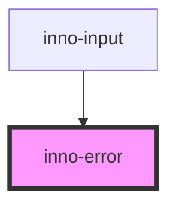

# inno-error

import Tabs from '@theme/Tabs';
import TabItem from '@theme/TabItem';
import {InnoError, InnoInput} from '@innomotics/brand-experience-react-lib';

<Tabs>
  <TabItem value="preview" label="Preview" default>
    <InnoInput label="Power" variant="dark">
     <input type="number" />
     <InnoError type="badInput">Not valid</InnoError>
    </InnoInput> 
  </TabItem>
  <TabItem value="Angular" label="Angular">
    ```js
    <inno-input label="Power" variant="light">
     <input type="number" />
     <inno-error type="badInput">Not valid</inno-error>
    </inno-input>  
    ```
  </TabItem>
  <TabItem value="React" label="React">
    ```js
    <InnoInput label="Power" variant="dark">
     <input type="number" />
     <InnoError type="badInput">Not valid</InnoError>
    </InnoInput> 
    ```
  </TabItem>
    <TabItem value="Vue" label="Vue">
    ```js
    <InnoInput label="Power" variant="dark">
     <input type="number" />
     <InnoError type="badInput">Not valid</InnoError>
    </InnoInput> 
    ```
  </TabItem>
</Tabs>


<!-- Auto Generated Below -->


## Properties

| Property  | Attribute | Description                                                                                            | Type                                                                                                                                                                                  | Default     |
| --------- | --------- | ------------------------------------------------------------------------------------------------------ | ------------------------------------------------------------------------------------------------------------------------------------------------------------------------------------- | ----------- |
| `active`  | `active`  | Show the error or not.                                                                                 | `boolean`                                                                                                                                                                             | `false`     |
| `type`    | `type`    | The input's validation error type, see: https://developer.mozilla.org/en-US/docs/Web/API/ValidityState | `"badInput" \| "customError" \| "patternMismatch" \| "rangeOverflow" \| "rangeUnderflow" \| "stepMismatch" \| "tooLong" \| "tooShort" \| "typeMismatch" \| "valid" \| "valueMissing"` | `undefined` |
| `variant` | `variant` | Theme variant of the input.                                                                            | `"dark" \| "light"`                                                                                                                                                                   | `'light'`   |


## Dependencies

### Used by

 - [inno-input](../inno-input)

### Graph


----------------------------------------------

*Built with [StencilJS](https://stenciljs.com/)*
