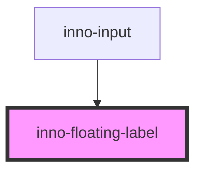

# inno-floating-label

<!-- Auto Generated Below -->

## Properties

| Property      | Attribute      | Description | Type      | Default     |
| ------------- | -------------- | ----------- | --------- | ----------- |
| `activeState` | `active-state` |             | `boolean` | `undefined` |
| `label`       | `label`        |             | `string`  | `undefined` |

## Dependencies

### Used by

 - [inno-input](../inno-input)

### Graph

----------------------------------------------

*Built with [StencilJS](https://stenciljs.com/)*
