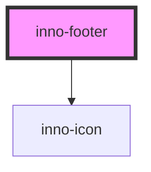

# inno-footer

## Footer content model

Models the available footer content types.

### Footer text based content

Show the defined text value.

| Property   | Value          | Description                                                          | Type     |
| ---------- | -------------- | -------------------------------------------------------------------- | -------- |
| `type`     | `footer:text`  | Type discriminator.                                                  | `string` |
| `selector` | `user defined` | User defined value which is emitted if the given content is clicked. | `string` |
| `text`     | `user defined` | Raw text to show.                                                    | `string` |
| `rel`      | `user defined` | Link relation type. Custom string or HTML specs defined types.       | `string` |

### Footer icon based content

Show the selected icon.

| Property   | Value          | Description                                                          | Type     |
| ---------- | -------------- | -------------------------------------------------------------------- | -------- |
| `type`     | `footer:icon`  | Type discriminator.                                                  | `string` |
| `selector` | user defined   | User defined value which is emitted if the given content is clicked. | `string` |
| `icon`     | icon name      | One of the defined icon name provided by the library.                | `string` |
| `rel`      | `user defined` | Link relation type. Custom string or HTML specs defined types.       | `string` |

### Link relation types

Ther link relation type can be a custom user defined value or
one of the defined types in the WHATWG HTML specification.

[https://html.spec.whatwg.org/multipage/links.html#linkTypes](https://html.spec.whatwg.org/multipage/links.html#linkTypes)

<!-- Auto Generated Below -->

## Overview

Represents the general footer for the Innomotics applications.

## Properties

| Property    | Attribute   | Description                              | Type                       | Default   |
| ----------- | ----------- | ---------------------------------------- | -------------------------- | --------- |
| `copyright` | `copyright` | The copyright label.                     | `string`                   | `''`      |
| `entries`   | --          | Generalized entries for the application. | `readonly FooterContent[]` | `[]`      |
| `variant`   | `variant`   | Theme variant property.                  | `"dark" \| "light"`        | `'light'` |

## Events

| Event             | Description                                                    | Type                  |
| ----------------- | -------------------------------------------------------------- | --------------------- |
| `contentSelected` | The selector value is emitted if the given content is clicked. | `CustomEvent<string>` |

## Dependencies

### Depends on

- [inno-icon](../inno-icon)

### Graph

----------------------------------------------

*Built with [StencilJS](https://stenciljs.com/)*
