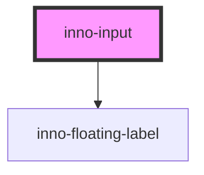

# inno-input

<!-- Auto Generated Below -->

## Properties

| Property   | Attribute   | Description | Type      | Default     |
| ---------- | ----------- | ----------- | --------- | ----------- |
| `isActive` | `is-active` |             | `boolean` | `undefined` |

## Dependencies

### Depends on

- [inno-floating-label](../inno-floating-label)

### Graph

----------------------------------------------

*Built with [StencilJS](https://stenciljs.com/)*
