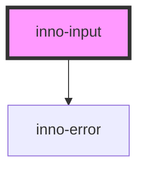

# inno-input

import Tabs from '@theme/Tabs';
import TabItem from '@theme/TabItem';
import {InnoInput} from '@innomotics/brand-experience-react-lib';

<Tabs>
  <TabItem value="preview" label="Preview" default>
  <div class="component-display">
    <div class="light-bg">
      <span class="bg-title">light background</span>
      <InnoInput label="Power" variant="light">
        <input type="number" />
      </InnoInput> 
    </div>
    <div class="dark-bg">
      <span class="bg-title">dark background</span>
      <InnoInput label="Power" variant="dark">
        <input type="number" />
      </InnoInput> 
    </div>
  </div>
  </TabItem>
  <TabItem value="Angular" label="Angular">
    ```js
  <div class="component-display">
    <div class="light-bg">
      <span class="bg-title">light background</span>
      <inno-input label="Power" variant="light">
        <input type="number" />
      </inno-input> 
    </div>
    <div class="dark-bg">
      <span class="bg-title">dark background</span>
      <inno-input label="Power" variant="dark">
        <input type="number" />
      </inno-input> 
    </div>
  </div>
    ```
  </TabItem>
  <TabItem value="React" label="React">
    ```js
  <div class="component-display">
    <div class="light-bg">
      <span class="bg-title">light background</span>
      <InnoInput label="Power" variant="light">
        <input type="number" />
      </InnoInput> 
    </div>
    <div class="dark-bg">
      <span class="bg-title">dark background</span>
      <InnoInput label="Power" variant="dark">
        <input type="number" />
      </InnoInput> 
    </div>
  </div>
    ```
  </TabItem>
    <TabItem value="Vue" label="Vue">
    ```js
  <div class="component-display">
    <div class="light-bg">
      <span class="bg-title">light background</span>
      <InnoInput label="Power" variant="light">
        <input type="number" />
      </InnoInput> 
    </div>
    <div class="dark-bg">
      <span class="bg-title">dark background</span>
      <InnoInput label="Power" variant="dark">
        <input type="number" />
      </InnoInput> 
    </div>
  </div>
    ```
  </TabItem>
</Tabs>

<!-- Auto Generated Below -->


## Properties

| Property    | Attribute    | Description                                                                                                                                                                                                                                       | Type                                                                                                                                                                                  | Default     |
| ----------- | ------------ | ------------------------------------------------------------------------------------------------------------------------------------------------------------------------------------------------------------------------------------------------- | ------------------------------------------------------------------------------------------------------------------------------------------------------------------------------------- | ----------- |
| `disabled`  | `disabled`   | Whether the input is disabled or not. Probably not needed to be set since the component  automatically detects if the inserted input element is disabled or not.                                                                                  | `boolean`                                                                                                                                                                             | `false`     |
| `error`     | `error`      | Error message to show. If you don't want to use this property you can manually add 'inno-error' components inside the 'inno-input' component. You can either use this property or use the manually added errors. Can't use both at the same time. | `string`                                                                                                                                                                              | `undefined` |
| `errortype` | `errortype`  | The input's validation error type, see: https://developer.mozilla.org/en-US/docs/Web/API/ValidityState <br/><br/>Only has an effect if 'error' has a value.                                                                                       | `"badInput" \| "customError" \| "patternMismatch" \| "rangeOverflow" \| "rangeUnderflow" \| "stepMismatch" \| "tooLong" \| "tooShort" \| "typeMismatch" \| "valid" \| "valueMissing"` | `undefined` |
| `isFocused` | `is-focused` | Whether the input is focused or not.                                                                                                                                                                                                              | `boolean`                                                                                                                                                                             | `undefined` |
| `label`     | `label`      | Floating label for the input.                                                                                                                                                                                                                     | `string`                                                                                                                                                                              | `undefined` |
| `variant`   | `variant`    | Color variant of the input.                                                                                                                                                                                                                       | `"dark" \| "light"`                                                                                                                                                                   | `'light'`   |


## Events

| Event          | Description                        | Type                            |
| -------------- | ---------------------------------- | ------------------------------- |
| `valueChanged` | Fired when the new value is valid. | `CustomEvent<number \| string>` |


## Dependencies

### Depends on

- [inno-error](../inno-error)

### Graph


----------------------------------------------

*Built with [StencilJS](https://stenciljs.com/)*
