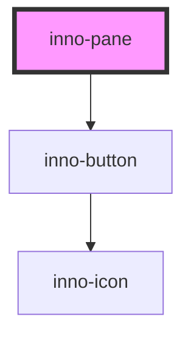

import Tabs from '@theme/Tabs';
import TabItem from '@theme/TabItem';
import {InnoPane, InnoButton} from '@innomotics/ix-react-lib';

# inno-pane

<Tabs>
  <TabItem value="preview-dark" label="Preview">
    <InnoPane id="pane" paneSize="500px" titleText="Pane title">
      Pane content
    </InnoPane>
    <InnoButton onClick={() => document.querySelector("#pane").expanded="true"}>Open pane</InnoButton>
  </TabItem>
  <TabItem value="Angular" label="Angular">
    ```html
    <inno-pane #pane pane-size="500px" title-text="Pane title">
      Pane content
    </inno-pane>
    <inno-button (click)="pane.expanded=true">Open pane</InnoButton>
    ```
  </TabItem>
  <TabItem value="React" label="React">
    ```tsx
    <InnoPane id="pane" paneSize="500px" titleText="Pane title">
      Pane content
    </InnoPane>
    <InnoButton onClick={() => document.querySelector("#pane").expanded="true"}>Open pane</InnoButton>
    ```
  </TabItem>
</Tabs>

<!-- Auto Generated Below -->


## Properties

| Property               | Attribute                 | Description                                                                                                                                                                                                                   | Type                                     | Default     |
| ---------------------- | ------------------------- | ----------------------------------------------------------------------------------------------------------------------------------------------------------------------------------------------------------------------------- | ---------------------------------------- | ----------- |
| `closeOnBackdropClick` | `close-on-backdrop-click` | Whether the pane is closeable by clicking outside of it.                                                                                                                                                                      | `boolean`                                | `true`      |
| `expanded`             | `expanded`                | Programatically control whether the pane is opened or closed.                                                                                                                                                                 | `boolean`                                | `false`     |
| `hideCloseButton`      | `hide-close-button`       | The pane comes with a close button by default. Hide it with this property.                                                                                                                                                    | `boolean`                                | `false`     |
| `paneSize`             | `pane-size`               | Size of the pane. It is a width value in case of 'left' and 'right' position, and a height value in case of 'top' and 'bottom' position.  All css units are supported which are supported by width and height css properties. | `string`                                 | `'100%'`    |
| `position`             | `position`                | Position of the pane.                                                                                                                                                                                                         | `"bottom" \| "left" \| "right" \| "top"` | `'right'`   |
| `titleText`            | `title-text`              | Title of the pane.                                                                                                                                                                                                            | `string`                                 | `undefined` |


## Events

| Event             | Description                                            | Type                                  |
| ----------------- | ------------------------------------------------------ | ------------------------------------- |
| `expandedChanged` | This event is fired when the pane is opened or closed. | `CustomEvent<{ expanded: boolean; }>` |


## Dependencies

### Depends on

- [inno-button](../inno-button)

### Graph


----------------------------------------------

*Built with [StencilJS](https://stenciljs.com/)*
