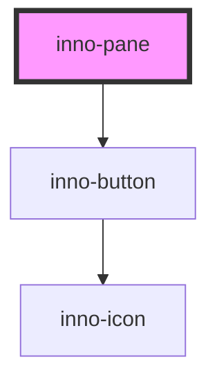

# inno-pane

<!-- Auto Generated Below -->

## Properties

| Property               | Attribute                 | Description | Type                                     | Default     |
| ---------------------- | ------------------------- | ----------- | ---------------------------------------- | ----------- |
| `closeOnBackdropClick` | `close-on-backdrop-click` |             | `boolean`                                | `true`      |
| `expanded`             | `expanded`                |             | `boolean`                                | `false`     |
| `hideCloseButton`      | `hide-close-button`       |             | `boolean`                                | `false`     |
| `paneSize`             | `pane-size`               |             | `string`                                 | `'100%'`    |
| `position`             | `position`                |             | `"bottom" \| "left" \| "right" \| "top"` | `'right'`   |
| `titleText`            | `title-text`              |             | `string`                                 | `undefined` |

## Events

| Event             | Description | Type                                  |
| ----------------- | ----------- | ------------------------------------- |
| `expandedChanged` |             | `CustomEvent<{ expanded: boolean; }>` |

## Dependencies

### Depends on

- [inno-button](../inno-button)

### Graph

----------------------------------------------

*Built with [StencilJS](https://stenciljs.com/)*
