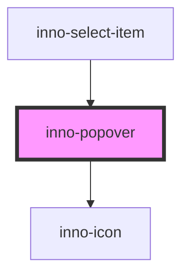

# inno-popover

import Tabs from '@theme/Tabs';
import TabItem from '@theme/TabItem';
import {InnoPopover} from '@innomotics/brand-experience-react-lib';

<Tabs>
  <TabItem value="preview" label="Preview" default>
  <div>
    <span id="onhoverspan">tooltip on hover (right)</span>
    <InnoPopover for="#onhoverspan" placement='right' trigger='hover' popover-title="title" variant="light">
    <p>Text</p>
  </InnoPopover>
  </div>
  <div>
    <span id="onclickspan">tooltip on click (bottom)</span>
    <InnoPopover for="#onclickspan" placement='bottom' popover-title="title">
    <p>Text</p>
    </InnoPopover>
  </div>
 </TabItem>
  <TabItem value="Angular" label="Angular">
    ```js
    <span id="onhoverspan">tooltip on hover (right)</span>
    <inno-popover for="#onhoverspan" placement='right' trigger='hover' popover-title="title" variant="light">
    <p>Text</p>
    </inno-popover>
    <span id="onclickspan">tooltip on click (bottom)</span>
    <inno-popover for="#onclickspan" placement='bottom' popover-title="title">
    <p>Text</p>
    </inno-popover>
    ```
  </TabItem>
  <TabItem value="React" label="React">
    ```js
    <span id="onhoverspan">tooltip on hover (right)</span>
    <InnoPopover for="#onhoverspan" placement='right' trigger='hover' popover-title="title" variant="light">
    <p>Text</p>
    </InnoPopover>
    <span id="onclickspan">tooltip on click (bottom)</span>
    <InnoPopover for="#onclickspan" placement='bottom' popover-title="title">
    <p>Text</p>
    </InnoPopover>
    ```
  </TabItem>
    <TabItem value="Vue" label="Vue">
    ```js
    <span id="onhoverspan">tooltip on hover (right)</span>
    <InnoPopover for="#onhoverspan" placement='right' trigger='hover' popover-title="title" variant="light">
    <p>Text</p>
    </InnoPopover>
    <span id="onclickspan">tooltip on click (bottom)</span>
    <InnoPopover for="#onclickspan" placement='bottom' popover-title="title">
    <p>Text</p>
    </InnoPopover>
    ```
  </TabItem>
</Tabs>


<!-- Auto Generated Below -->


## Properties

| Property       | Attribute       | Description                                                                                                                                                                             | Type                                                                                                                                                                 | Default     |
| -------------- | --------------- | --------------------------------------------------------------------------------------------------------------------------------------------------------------------------------------- | -------------------------------------------------------------------------------------------------------------------------------------------------------------------- | ----------- |
| `closable`     | `closable`      | Popover will have a close button. Has no effect if trigger type is 'hover'.                                                                                                             | `boolean`                                                                                                                                                            | `false`     |
| `for`          | `for`           | Css selector of the element the popover is for.                                                                                                                                         | `string`                                                                                                                                                             | `undefined` |
| `hasBackdrop`  | `has-backdrop`  | Popover should have a backdrop. Has no effect if trigger type is 'hover'.                                                                                                               | `boolean`                                                                                                                                                            | `false`     |
| `placement`    | `placement`     | Position of the popover. If there is not enough space it will be automatically placed to where it has enough place.                                                                     | `"bottom" \| "bottom-end" \| "bottom-start" \| "left" \| "left-end" \| "left-start" \| "right" \| "right-end" \| "right-start" \| "top" \| "top-end" \| "top-start"` | `'top'`     |
| `popoverText`  | `popover-text`  | Contents of the text. Can be either html or a simple string. Can be omitted. You can use this property if you want a simple tooltip,  otherwise you can provide your own html directly. | `string`                                                                                                                                                             | `undefined` |
| `popoverTitle` | `popover-title` | Contents of the title. Can be either html or a simple string. Can be omitted.                                                                                                           | `string`                                                                                                                                                             | `undefined` |
| `trigger`      | `trigger`       | How to show the popover. If set to 'manual' then you need to programatically modify the 'visibile' property.                                                                            | `"click" \| "hover" \| "manual"`                                                                                                                                     | `'click'`   |
| `variant`      | `variant`       | Color variant of the popover.                                                                                                                                                           | `"dark" \| "light"`                                                                                                                                                  | `'dark'`    |
| `visible`      | `visible`       | Programatically change whether the popover is visible or not.                                                                                                                           | `boolean`                                                                                                                                                            | `false`     |


## Events

| Event               | Description                   | Type                |
| ------------------- | ----------------------------- | ------------------- |
| `innoPopoverHidden` | Fired when popover is hidden. | `CustomEvent<void>` |
| `innoPopoverShown`  | Fired when popover is shown.  | `CustomEvent<void>` |


## Methods

### `hideTooltip() => Promise<void>`

Hide the tooltip.

#### Returns

Type: `Promise<void>`


### `showTooltip() => Promise<void>`

Show the tooltip.

#### Returns

Type: `Promise<void>`


## Dependencies

### Used by

 - [inno-select-item](../inno-select-item)

### Depends on

- [inno-icon](../inno-icon)

### Graph


----------------------------------------------

*Built with [StencilJS](https://stenciljs.com/)*
