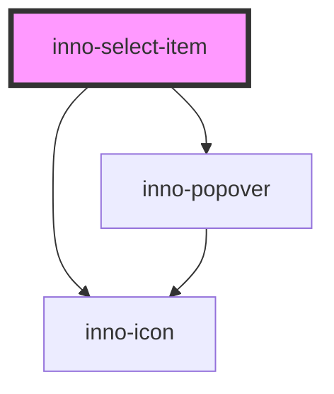

# inno-select-item

<!-- Auto Generated Below -->

## Properties

| Property                     | Attribute                       | Description                                                                                                                                                                                                                                                                       | Type                                                                                                                                                                 | Default                   |
| ---------------------------- | ------------------------------- | --------------------------------------------------------------------------------------------------------------------------------------------------------------------------------------------------------------------------------------------------------------------------------- | -------------------------------------------------------------------------------------------------------------------------------------------------------------------- | ------------------------- |
| `addToFavoritesLabel`        | `add-to-favorites-label`        | Tooltip text for favorite add. The tooltip is only visible if the InnoSelectItem has a unique id.                                                                                                                                                                                 | `string`                                                                                                                                                             | `"Add to favorites"`      |
| `canFavorite`                | `can-favorite`                  | Adds a favorite icon to the selectable item. If you press this icon an event will be fired with the selected item.  You have to take care of managing and ordering the array of favorite items in your business logic. Clicking on the favorite icon will not close the dropdown. | `boolean`                                                                                                                                                            | `false`                   |
| `favoriteIconTooltipOffset`  | `favorite-icon-tooltip-offset`  | Offset of the favorite icon tooltip position in pixels. Please note that the offset will remain the same in case the desired placement does not fit.                                                                                                                              | `number`                                                                                                                                                             | `8`                       |
| `favoriteIconTooltipPos`     | `favorite-icon-tooltip-pos`     | Position of the favorite icon tooltip. Please note that the offset will remain the same in case the desired placement does not fit.                                                                                                                                               | `"bottom" \| "bottom-end" \| "bottom-start" \| "left" \| "left-end" \| "left-start" \| "right" \| "right-end" \| "right-start" \| "top" \| "top-end" \| "top-start"` | `"right"`                 |
| `favoriteIconTooltipVariant` | `favorite-icon-tooltip-variant` | Color variant of the favorite icon tooltip.                                                                                                                                                                                                                                       | `"dark" \| "light"`                                                                                                                                                  | `'light'`                 |
| `hasSeparator`               | `has-separator`                 | A simple separator for the item. You can use it for example to visually separate the favorited and non-favorited items.                                                                                                                                                           | `boolean`                                                                                                                                                            | `false`                   |
| `icon`                       | `icon`                          | Optional icon for the label. Use either this or the iconFont property. For possible values, see: https://innomotics.github.io/brand-experience/docs/icons/                                                                                                                        | `string`                                                                                                                                                             | `undefined`               |
| `iconFont`                   | `icon-font`                     | Optional icon font for the label. Use either this or the icon property. For possible values, see: https://innomotics.github.io/brand-experience/docs/fonts/InnomoticsUiFont                                                                                                       | `string`                                                                                                                                                             | `undefined`               |
| `isFavorite`                 | `is-favorite`                   | The selectable item is favorited or not.                                                                                                                                                                                                                                          | `boolean`                                                                                                                                                            | `false`                   |
| `label`                      | `label`                         | Label of the item, can be different from the value.                                                                                                                                                                                                                               | `string`                                                                                                                                                             | `undefined`               |
| `removeFromFavoritesLabel`   | `remove-from-favorites-label`   | Tooltip text for favorite remove. The tooltip is only visible if the InnoSelectItem has a unique id.                                                                                                                                                                              | `string`                                                                                                                                                             | `"Remove from favorites"` |
| `selected`                   | `selected`                      | Whether the item is selected or not.                                                                                                                                                                                                                                              | `boolean`                                                                                                                                                            | `false`                   |
| `value`                      | `value`                         | Value of the item.                                                                                                                                                                                                                                                                | `any`                                                                                                                                                                | `undefined`               |

## Events

| Event              | Description                                                                                                   | Type               |
| ------------------ | ------------------------------------------------------------------------------------------------------------- | ------------------ |
| `itemFavorited`    | This event is fired whenever an item is favorited.                                                            | `CustomEvent<any>` |
| `itemLabelChanged` | This event is fired whenever the selected item's label changes. The inno-select component then will rerender. | `CustomEvent<any>` |
| `itemSelected`     | This event is fired whenever an item is selected.                                                             | `CustomEvent<any>` |
| `itemUnfavorited`  | This event is fired whenever an item is removed from favorites.                                               | `CustomEvent<any>` |

## Dependencies

### Depends on

- [inno-popover](../inno-popover)
- [inno-icon](../inno-icon)

### Graph

----------------------------------------------

*Built with [StencilJS](https://stenciljs.com/)*
