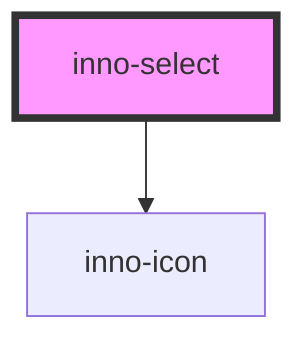

# inno-select

import Tabs from '@theme/Tabs';
import TabItem from '@theme/TabItem';
import {InnoSelect, InnoSelectItem} from '@innomotics/ix-react-lib';

<Tabs>
  <TabItem value="preview" label="Preview" default>
    <InnoSelect label="Select" value="item1">
      <InnoSelectItem value="item1" label="item1"></InnoSelectItem>
      <InnoSelectItem value="item2" label="item2"></InnoSelectItem>
    </InnoSelect>
  </TabItem>
  <TabItem value="Angular" label="Angular">
    ```js
    <inno-select label="Select" value="item1">
      <inno-select-item value="item1" label="item1"></inno-select-item>
      <inno-select-item value="item2" label="item2"></inno-select-item>
    </inno-select>
    ```
  </TabItem>
  <TabItem value="React" label="React">
    ```js
    <InnoSelect label="Select" value="item1">
      <InnoSelectItem value="item1" label="item1"></InnoSelectItem>
      <InnoSelectItem value="item2" label="item2"></InnoSelectItem>
    </InnoSelect>
    ```
  </TabItem>
    <TabItem value="Vue" label="Vue">
    ```js
    <InnoSelect label="Select" value="item1">
      <InnoSelectItem value="item1" label="item1"></InnoSelectItem>
      <InnoSelectItem value="item2" label="item2"></InnoSelectItem>
    </InnoSelect>
    ```
  </TabItem>
</Tabs>

<!-- Auto Generated Below -->


## Properties

| Property     | Attribute     | Description | Type                 | Default     |
| ------------ | ------------- | ----------- | -------------------- | ----------- |
| `disabled`   | `disabled`    |             | `boolean`            | `false`     |
| `iconDriven` | `icon-driven` |             | `boolean`            | `false`     |
| `isFocused`  | `is-focused`  |             | `boolean`            | `undefined` |
| `label`      | `label`       |             | `string`             | `undefined` |
| `name`       | `name`        |             | `string`             | `undefined` |
| `type`       | `type`        |             | `"number" \| "text"` | `'text'`    |
| `value`      | `value`       |             | `string`             | `undefined` |
| `variant`    | `variant`     |             | `"dark" \| "light"`  | `'light'`   |


## Events

| Event          | Description | Type                  |
| -------------- | ----------- | --------------------- |
| `valueChanged` |             | `CustomEvent<string>` |


## Dependencies

### Depends on

- [inno-icon](../inno-icon)

### Graph


----------------------------------------------

*Built with [StencilJS](https://stenciljs.com/)*
