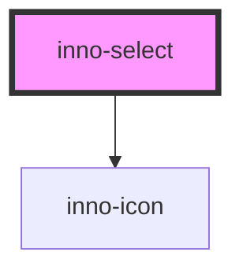

# inno-select

import Tabs from '@theme/Tabs';
import TabItem from '@theme/TabItem';
import {InnoSelect, InnoSelectItem} from '@innomotics/brand-experience-react-lib';

<Tabs>
  <TabItem value="preview" label="Preview" default>
    <div class="component-display">
        <div class="light-bg">
          <span class="bg-title">light background</span>
          <InnoSelect label="Select" value="item1">
            <InnoSelectItem value="item1" label="item1"></InnoSelectItem>
            <InnoSelectItem value="item2" label="item2"></InnoSelectItem>
          </InnoSelect>
          <InnoSelect label="Select" icon="home">
            <InnoSelectItem value="item1" label="item1" icon="play"></InnoSelectItem>
            <InnoSelectItem value="item2" label="item2" icon="pause"></InnoSelectItem>
          </InnoSelect>
        </div>
        <div class="dark-bg">
          <span class="bg-title">dark background</span>
          <InnoSelect label="Select" value="item1">
            <InnoSelectItem value="item1" label="item1"></InnoSelectItem>
            <InnoSelectItem value="item2" label="item2"></InnoSelectItem>
          </InnoSelect>
          <InnoSelect label="Select" icon="home">
            <InnoSelectItem value="item1" label="item1" icon="play"></InnoSelectItem>
            <InnoSelectItem value="item2" label="item2" icon="pause"></InnoSelectItem>
          </InnoSelect>
        </div>
    </div>
  </TabItem>
  <TabItem value="Angular" label="Angular">
    ```js
      <div class="component-display">
        <div class="light-bg">
          <span class="bg-title">light background</span>
          <inno-select label="Select" value="item1">
            <inno-select-item value="item1" label="item1"></inno-select-item>
            <inno-select-item value="item2" label="item2"></inno-select-item>
          </inno-select>
          <inno-select label="Select" icon="home">
            <inno-select-item value="item1" label="item1" icon="play"></inno-select-item>
            <inno-select-item value="item2" label="item2" icon="pause"></inno-select-item>
          </inno-select>
        </div>
        <div class="dark-bg">
          <span class="bg-title">dark background</span>
          <inno-select label="Select" value="item1">
            <inno-select-item value="item1" label="item1"></inno-select-item>
            <inno-select-item value="item2" label="item2"></inno-select-item>
          </inno-select>
          <inno-select label="Select" icon="home">
            <inno-select-item value="item1" label="item1" icon="play"></inno-select-item>
            <inno-select-item value="item2" label="item2" icon="pause"></inno-select-item>
          </inno-select>
        </div>
    </div>
    ```
  </TabItem>
  <TabItem value="React" label="React">
    ```js
        <div class="component-display">
        <div class="light-bg">
          <span class="bg-title">light background</span>
          <InnoSelect label="Select" value="item1">
            <InnoSelectItem value="item1" label="item1"></InnoSelectItem>
            <InnoSelectItem value="item2" label="item2"></InnoSelectItem>
          </InnoSelect>
          <InnoSelect label="Select" icon="home">
            <InnoSelectItem value="item1" label="item1" icon="play"></InnoSelectItem>
            <InnoSelectItem value="item2" label="item2" icon="pause"></InnoSelectItem>
          </InnoSelect>
        </div>
        <div class="dark-bg">
          <span class="bg-title">dark background</span>
          <InnoSelect label="Select" value="item1">
            <InnoSelectItem value="item1" label="item1"></InnoSelectItem>
            <InnoSelectItem value="item2" label="item2"></InnoSelectItem>
          </InnoSelect>
          <InnoSelect label="Select" icon="home">
            <InnoSelectItem value="item1" label="item1" icon="play"></InnoSelectItem>
            <InnoSelectItem value="item2" label="item2" icon="pause"></InnoSelectItem>
          </InnoSelect>
        </div>
    </div>
    ```
  </TabItem>
    <TabItem value="Vue" label="Vue">
    ```js
    <div class="component-display">
        <div class="light-bg">
          <span class="bg-title">light background</span>
          <InnoSelect label="Select" value="item1">
            <InnoSelectItem value="item1" label="item1"></InnoSelectItem>
            <InnoSelectItem value="item2" label="item2"></InnoSelectItem>
          </InnoSelect>
          <InnoSelect label="Select" icon="home">
            <InnoSelectItem value="item1" label="item1" icon="play"></InnoSelectItem>
            <InnoSelectItem value="item2" label="item2" icon="pause"></InnoSelectItem>
          </InnoSelect>
        </div>
        <div class="dark-bg">
          <span class="bg-title">dark background</span>
          <InnoSelect label="Select" value="item1">
            <InnoSelectItem value="item1" label="item1"></InnoSelectItem>
            <InnoSelectItem value="item2" label="item2"></InnoSelectItem>
          </InnoSelect>
          <InnoSelect label="Select" icon="home">
            <InnoSelectItem value="item1" label="item1" icon="play"></InnoSelectItem>
            <InnoSelectItem value="item2" label="item2" icon="pause"></InnoSelectItem>
          </InnoSelect>
        </div>
    </div>
    ```
  </TabItem>
</Tabs>

<!-- Auto Generated Below -->


## Properties

| Property    | Attribute    | Description                                                                                     | Type                 | Default     |
| ----------- | ------------ | ----------------------------------------------------------------------------------------------- | -------------------- | ----------- |
| `disabled`  | `disabled`   | Whether the select is disabled or not.                                                          | `boolean`            | `false`     |
| `icon`      | `icon`       | Icon for select when no item selected When icon is present the label is not behaves as floating | `string`             | `undefined` |
| `isFocused` | `is-focused` | Whether the select is focused or not.                                                           | `boolean`            | `undefined` |
| `label`     | `label`      | Label for the select when no item selected.                                                     | `string`             | `undefined` |
| `type`      | `type`       | Type of the select.                                                                             | `"number" \| "text"` | `'text'`    |
| `value`     | `value`      | Value of the select.                                                                            | `string`             | `undefined` |
| `variant`   | `variant`    | Color variant of the select.                                                                    | `"dark" \| "light"`  | `'light'`   |


## Events

| Event          | Description                                 | Type                  |
| -------------- | ------------------------------------------- | --------------------- |
| `valueChanged` | This event is fired when the value changes. | `CustomEvent<string>` |


## Dependencies

### Depends on

- [inno-icon](../inno-icon)

### Graph


----------------------------------------------

*Built with [StencilJS](https://stenciljs.com/)*
