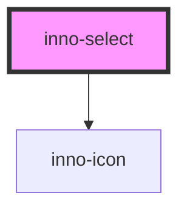

# inno-select

<!-- Auto Generated Below -->

## Properties

| Property    | Attribute    | Description | Type                 | Default     |
| ----------- | ------------ | ----------- | -------------------- | ----------- |
| `disabled`  | `disabled`   |             | `boolean`            | `false`     |
| `isActive`  | `is-active`  |             | `boolean`            | `undefined` |
| `isFocused` | `is-focused` |             | `boolean`            | `undefined` |
| `label`     | `label`      |             | `string`             | `undefined` |
| `name`      | `name`       |             | `string`             | `undefined` |
| `type`      | `type`       |             | `"number" \| "text"` | `'text'`    |
| `value`     | `value`      |             | `string`             | `undefined` |
| `variant`   | `variant`    |             | `"dark" \| "light"`  | `'light'`   |

## Events

| Event          | Description | Type                  |
| -------------- | ----------- | --------------------- |
| `valueChanged` |             | `CustomEvent<string>` |

## Dependencies

### Depends on

- [inno-icon](../inno-icon)

### Graph

----------------------------------------------

*Built with [StencilJS](https://stenciljs.com/)*
