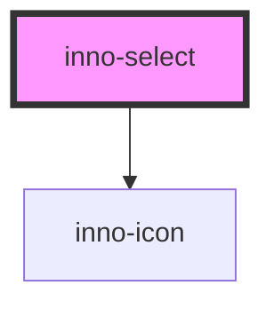

# inno-select

import Tabs from '@theme/Tabs';
import TabItem from '@theme/TabItem';
import {InnoSelect, InnoSelectItem} from '@innomotics/brand-experience-react-lib';

<Tabs>
  <TabItem value="preview" label="Preview" default>
    <div class="component-display">
        <div class="light-bg">
          <span class="bg-title">light background</span>
          <InnoSelect label="Select" value="item1">
            <InnoSelectItem value="item1" label="item1"></InnoSelectItem>
            <InnoSelectItem value="item2" label="item2" hasSeparator="true"></InnoSelectItem>
            <InnoSelectItem id="item3" value="item3" label="item3" canFavorite="true"></InnoSelectItem>
            <InnoSelectItem id="item4" value="item4" label="item4" canFavorite="true"></InnoSelectItem>
          </InnoSelect>
          <InnoSelect label="Select" icon="home">
            <InnoSelectItem value="item1" label="item1" icon="play"></InnoSelectItem>
            <InnoSelectItem value="item2" label="item2" hasSeparator="true"></InnoSelectItem>
            <InnoSelectItem id="item3-2" value="item3" label="item3" canFavorite="true"></InnoSelectItem>
            <InnoSelectItem id="item4-2" value="item4" label="item4" canFavorite="true"></InnoSelectItem>
          </InnoSelect>
          <InnoSelect label="Select" value="item1" variant="primary">
            <InnoSelectItem value="item1" label="item1"></InnoSelectItem>
            <InnoSelectItem value="item2" label="item2" hasSeparator="true"></InnoSelectItem>
            <InnoSelectItem id="item3" value="item3" label="item3" canFavorite="true"></InnoSelectItem>
            <InnoSelectItem id="item4" value="item4" label="item4" canFavorite="true"></InnoSelectItem>
          </InnoSelect>
        </div>
        <div class="dark-bg">
          <span class="bg-title">dark background</span>
          <InnoSelect label="Select" value="item1" variant="dark">
            <InnoSelectItem value="item1" label="item1"></InnoSelectItem>
            <InnoSelectItem value="item2" label="item2" hasSeparator="true"></InnoSelectItem>
            <InnoSelectItem id="item3-3" value="item3" label="item3" canFavorite="true"></InnoSelectItem>
            <InnoSelectItem id="item4-3" value="item4" label="item4" canFavorite="true"></InnoSelectItem>
          </InnoSelect>
          <InnoSelect label="Select" icon="home" variant="dark">
            <InnoSelectItem value="item1" label="item1" icon="play"></InnoSelectItem>
            <InnoSelectItem value="item2" label="item2" hasSeparator="true"></InnoSelectItem>
            <InnoSelectItem id="item3-4" value="item3" label="item3" canFavorite="true"></InnoSelectItem>
            <InnoSelectItem id="item4-4" value="item4" label="item4" canFavorite="true"></InnoSelectItem>
          </InnoSelect>
          <InnoSelect label="Select" value="item1" variant="primary">
            <InnoSelectItem value="item1" label="item1"></InnoSelectItem>
            <InnoSelectItem value="item2" label="item2" hasSeparator="true"></InnoSelectItem>
            <InnoSelectItem id="item3" value="item3" label="item3" canFavorite="true"></InnoSelectItem>
            <InnoSelectItem id="item4" value="item4" label="item4" canFavorite="true"></InnoSelectItem>
          </InnoSelect>
        </div>
    </div>
  </TabItem>
  <TabItem value="Angular" label="Angular">
    ```js
      <div class="component-display">
        <div class="light-bg">
          <span class="bg-title">light background</span>
          <inno-select label="Select" value="item1">
            <inno-select-item value="item1" label="item1"></inno-select-item>
            <inno-select-item value="item2" label="item2" has-separator="true"></inno-select-item>
            <inno-select-item id="item3" value="item3" label="item3" can-favorite="true"></inno-select-item>
            <inno-select-item id="item4" value="item4" label="item4" can-favorite="true"></inno-select-item>
          </inno-select>
          <inno-select label="Select" icon="home">
            <inno-select-item value="item1" label="item1" icon="play"></inno-select-item>
            <inno-select-item value="item2" label="item2" has-separator="true"></inno-select-item>
            <inno-select-item id="item3-2" value="item3" label="item3" can-favorite="true"></inno-select-item>
            <inno-select-item id="item4-2" value="item4" label="item4" can-favorite="true"></inno-select-item>
          </inno-select>
          <inno-select label="Select" value="item1" variant="primary">
            <inno-select-item value="item1" label="item1"></inno-select-item>
            <inno-select-item value="item2" label="item2" has-separator="true"></inno-select-item>
            <inno-select-item id="item3" value="item3" label="item3" can-favorite="true"></inno-select-item>
            <inno-select-item id="item4" value="item4" label="item4" can-favorite="true"></inno-select-item>
          </inno-select>
        </div>
        <div class="dark-bg">
          <span class="bg-title">dark background</span>
          <inno-select label="Select" value="item1" variant="dark">
            <inno-select-item value="item1" label="item1"></inno-select-item>
            <inno-select-item value="item2" label="item2" has-separator="true"></inno-select-item>
            <inno-select-item id="item3-3" value="item3" label="item3" can-favorite="true"></inno-select-item>
            <inno-select-item id="item4-3" value="item4" label="item4" can-favorite="true"></inno-select-item>
          </inno-select>
          <inno-select label="Select" icon="home" variant="dark">
            <inno-select-item value="item1" label="item1" icon="play"></inno-select-item>
            <inno-select-item value="item2" label="item2" has-separator="true"></inno-select-item>
            <inno-select-item id="item3-4" value="item3" label="item3" can-favorite="true"></inno-select-item>
            <inno-select-item id="item4-4" value="item4" label="item4" can-favorite="true"></inno-select-item>
          </inno-select>
          <inno-select label="Select" value="item1" variant="primary">
            <inno-select-item value="item1" label="item1"></inno-select-item>
            <inno-select-item value="item2" label="item2" has-separator="true"></inno-select-item>
            <inno-select-item id="item3" value="item3" label="item3" can-favorite="true"></inno-select-item>
            <inno-select-item id="item4" value="item4" label="item4" can-favorite="true"></inno-select-item>
          </inno-select>
        </div>
    </div>
    ```
  </TabItem>
  <TabItem value="React" label="React">
    ```js
        <div class="component-display">
        <div class="light-bg">
          <span class="bg-title">light background</span>
          <InnoSelect label="Select" value="item1">
            <InnoSelectItem value="item1" label="item1"></InnoSelectItem>
            <InnoSelectItem value="item2" label="item2" hasSeparator="true"></InnoSelectItem>
            <InnoSelectItem id="item3" value="item3" label="item3" canFavorite="true"></InnoSelectItem>
            <InnoSelectItem id="item4" value="item4" label="item4" canFavorite="true"></InnoSelectItem>
          </InnoSelect>
          <InnoSelect label="Select" icon="home">
            <InnoSelectItem value="item1" label="item1" icon="play"></InnoSelectItem>
            <InnoSelectItem value="item2" label="item2" hasSeparator="true"></InnoSelectItem>
            <InnoSelectItem id="item3-2" value="item3" label="item3" canFavorite="true"></InnoSelectItem>
            <InnoSelectItem id="item4-2" value="item4" label="item4" canFavorite="true"></InnoSelectItem>
          </InnoSelect>
          <InnoSelect label="Select" value="item1" variant="primary">
            <InnoSelectItem value="item1" label="item1"></InnoSelectItem>
            <InnoSelectItem value="item2" label="item2" hasSeparator="true"></InnoSelectItem>
            <InnoSelectItem id="item3" value="item3" label="item3" canFavorite="true"></InnoSelectItem>
            <InnoSelectItem id="item4" value="item4" label="item4" canFavorite="true"></InnoSelectItem>
          </InnoSelect>
        </div>
        <div class="dark-bg">
          <span class="bg-title">dark background</span>
          <InnoSelect label="Select" value="item1" variant="dark">
            <InnoSelectItem value="item1" label="item1"></InnoSelectItem>
            <InnoSelectItem value="item2" label="item2" hasSeparator="true"></InnoSelectItem>
            <InnoSelectItem id="item3-3" value="item3" label="item3" canFavorite="true"></InnoSelectItem>
            <InnoSelectItem id="item4-3" value="item4" label="item4" canFavorite="true"></InnoSelectItem>
          </InnoSelect>
          <InnoSelect label="Select" icon="home" variant="dark">
            <InnoSelectItem value="item1" label="item1" icon="play"></InnoSelectItem>
            <InnoSelectItem value="item2" label="item2" hasSeparator="true"></InnoSelectItem>
            <InnoSelectItem id="item3-4" value="item3" label="item3" canFavorite="true"></InnoSelectItem>
            <InnoSelectItem id="item4-4" value="item4" label="item4" canFavorite="true"></InnoSelectItem>
          </InnoSelect>
          <InnoSelect label="Select" value="item1" variant="primary">
            <InnoSelectItem value="item1" label="item1"></InnoSelectItem>
            <InnoSelectItem value="item2" label="item2" hasSeparator="true"></InnoSelectItem>
            <InnoSelectItem id="item3" value="item3" label="item3" canFavorite="true"></InnoSelectItem>
            <InnoSelectItem id="item4" value="item4" label="item4" canFavorite="true"></InnoSelectItem>
          </InnoSelect>
        </div>
    </div>
    ```
  </TabItem>
    <TabItem value="Vue" label="Vue">
    ```js
    <div class="component-display">
        <div class="light-bg">
          <span class="bg-title">light background</span>
          <InnoSelect label="Select" value="item1">
            <InnoSelectItem value="item1" label="item1"></InnoSelectItem>
            <InnoSelectItem value="item2" label="item2" hasSeparator="true"></InnoSelectItem>
            <InnoSelectItem id="item3" value="item3" label="item3" canFavorite="true"></InnoSelectItem>
            <InnoSelectItem id="item4" value="item4" label="item4" canFavorite="true"></InnoSelectItem>
          </InnoSelect>
          <InnoSelect label="Select" icon="home">
            <InnoSelectItem value="item1" label="item1" icon="play"></InnoSelectItem>
            <InnoSelectItem value="item2" label="item2" hasSeparator="true"></InnoSelectItem>
            <InnoSelectItem id="item3-2" value="item3" label="item3" canFavorite="true"></InnoSelectItem>
            <InnoSelectItem id="item4-2" value="item4" label="item4" canFavorite="true"></InnoSelectItem>
          </InnoSelect>
          <InnoSelect label="Select" value="item1" variant="primary">
            <InnoSelectItem value="item1" label="item1"></InnoSelectItem>
            <InnoSelectItem value="item2" label="item2" hasSeparator="true"></InnoSelectItem>
            <InnoSelectItem id="item3" value="item3" label="item3" canFavorite="true"></InnoSelectItem>
            <InnoSelectItem id="item4" value="item4" label="item4" canFavorite="true"></InnoSelectItem>
          </InnoSelect>
        </div>
        <div class="dark-bg">
          <span class="bg-title">dark background</span>
          <InnoSelect label="Select" value="item1" variant="dark">
            <InnoSelectItem value="item1" label="item1"></InnoSelectItem>
            <InnoSelectItem value="item2" label="item2" hasSeparator="true"></InnoSelectItem>
            <InnoSelectItem id="item3-3" value="item3" label="item3" canFavorite="true"></InnoSelectItem>
            <InnoSelectItem id="item4-3" value="item4" label="item4" canFavorite="true"></InnoSelectItem>
          </InnoSelect>
          <InnoSelect label="Select" icon="home" variant="dark">
            <InnoSelectItem value="item1" label="item1" icon="play"></InnoSelectItem>
            <InnoSelectItem value="item2" label="item2" hasSeparator="true"></InnoSelectItem>
            <InnoSelectItem id="item3-4" value="item3" label="item3" canFavorite="true"></InnoSelectItem>
            <InnoSelectItem id="item4-4" value="item4" label="item4" canFavorite="true"></InnoSelectItem>
          </InnoSelect>
          <InnoSelect label="Select" value="item1" variant="primary">
            <InnoSelectItem value="item1" label="item1"></InnoSelectItem>
            <InnoSelectItem value="item2" label="item2" hasSeparator="true"></InnoSelectItem>
            <InnoSelectItem id="item3" value="item3" label="item3" canFavorite="true"></InnoSelectItem>
            <InnoSelectItem id="item4" value="item4" label="item4" canFavorite="true"></InnoSelectItem>
          </InnoSelect>
        </div>
    </div>
    ```
  </TabItem>
</Tabs>

<!-- Auto Generated Below -->


## Properties

| Property                         | Attribute                            | Description                                                                                                                                                                                                                                                                                                                                                  | Type                             | Default                         |
| -------------------------------- | ------------------------------------ | ------------------------------------------------------------------------------------------------------------------------------------------------------------------------------------------------------------------------------------------------------------------------------------------------------------------------------------------------------------ | -------------------------------- | ------------------------------- |
| `disableFloatingLabelAutoResize` | `disable-floating-label-auto-resize` | The floating label is an absolutely positioned element meaning if it is too long it will grow out of the boundaries of the InnoSelect component. By default the InnoSelect component automatically resizes the floating label so it will fit inside. You can turn this behavior off e.g. if you are sure the label will always fit or it causes some issues. | `boolean`                        | `false`                         |
| `disabled`                       | `disabled`                           | Whether the select is disabled or not.                                                                                                                                                                                                                                                                                                                       | `boolean`                        | `false`                         |
| `disabledBackgroundColor`        | `disabled-background-color`          | Depending on the container html element's background color you can choose a lighter or darker disabled style. Only applicable when variant is 'primary'.                                                                                                                                                                                                     | `"dark" \| "light"`              | `'light'`                       |
| `dropdownWidth`                  | `dropdown-width`                     | By default the InnoSelect component automatically resizes the dropdown so it will be as wide as the component itself. You can override it to be a fixed width. Accepts any value that the 'width' css property accepts, e.g. "300px" or "min-content"                                                                                                        | `string`                         | `undefined`                     |
| `hasIcons`                       | `has-icons`                          | Whether the select should use icons. You only have to set this to true if you don't want to use the icon or iconFont properties since your select has no state where nothing is selected.                                                                                                                                                                    | `boolean`                        | `false`                         |
| `icon`                           | `icon`                               | Icon for select when no item selected. Use either this or the iconFont property. When icon is present the label doesn't behave as floating. For possible values, see: https://innomotics.github.io/brand-experience/docs/icons/                                                                                                                              | `string`                         | `undefined`                     |
| `iconFont`                       | `icon-font`                          | Icon font for select when no item selected. Use either this or the icon property. When icon is present the label doesn't behave as floating. For possible values, see: https://innomotics.github.io/brand-experience/docs/fonts/InnomoticsUiFont                                                                                                             | `string`                         | `undefined`                     |
| `keyValueSelector`               | --                                   | If you work with object arrays you can set a simple function which returns the unique key value  so the objects can be differentiated. By default we assume you work with simple arrays so we simply return the value as it is, in that case you don't have to provide this function.                                                                        | `(val: any) => any`              | `(val: any) => { return val; }` |
| `label`                          | `label`                              | Label for the select when no item selected.                                                                                                                                                                                                                                                                                                                  | `string`                         | `undefined`                     |
| `value`                          | `value`                              | Value of the select.                                                                                                                                                                                                                                                                                                                                         | `any`                            | `undefined`                     |
| `variant`                        | `variant`                            | Color variant of the select.                                                                                                                                                                                                                                                                                                                                 | `"dark" \| "light" \| "primary"` | `'light'`                       |


## Events

| Event                  | Description                                                                                                                                                                | Type                  |
| ---------------------- | -------------------------------------------------------------------------------------------------------------------------------------------------------------------------- | --------------------- |
| `dropdownClosed`       | This event is fired when the dropdown is closed. You can use this event for example  if you want to reorder your InnoSelectItems after the favorited elements are changed. | `CustomEvent<void>`   |
| `favoriteItemsChanged` | This event is fired when an item is added to or removed from favorites. The event contains all of the favorited items.                                                     | `CustomEvent<any>`    |
| `itemIsFavorited`      | This event is fired when an item is favorited. You have to take care of managing and ordering the array of favorite items in your business logic.                          | `CustomEvent<any>`    |
| `itemIsUnfavorited`    | This event is fired when an item is removed from favorites. You have to take care of managing and ordering the array of favorite items in your business logic.             | `CustomEvent<any>`    |
| `valueChanged`         | This event is fired when the value changes.                                                                                                                                | `CustomEvent<string>` |


## Methods

### `refresh() => Promise<void>`

Can be used to force the inno-select component to rerender.

#### Returns

Type: `Promise<void>`


## Dependencies

### Depends on

- [inno-icon](../inno-icon)

### Graph


----------------------------------------------

*Built with [StencilJS](https://stenciljs.com/)*
