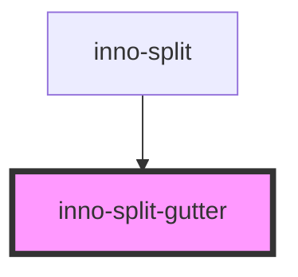

# inno-split-gutter

<!-- Auto Generated Below -->

## Overview

Gutter for the inno-split component. Inserted automatically. Should not be used as a standalone component.

## Dependencies

### Used by

 - [inno-split](../inno-split)

### Graph

----------------------------------------------

*Built with [StencilJS](https://stenciljs.com/)*
