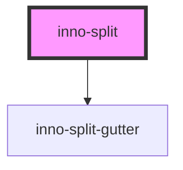

# inno-split

import Tabs from '@theme/Tabs';
import TabItem from '@theme/TabItem';
import {InnoSplit, InnoSplitItem} from '@innomotics/brand-experience-react-lib';

<Tabs>
  <TabItem value="preview" label="Preview" default>
  <div class="component-display">
    <div class="light-bg" style={{height: '500px'}}>
      <InnoSplit slotNames={['slot1', 'slot2', 'slot3']} orientation="horizontal">
        <InnoSplitItem>
          <div style={{backgroundColor: 'lightgray', height: '100%'}}>split content 1</div>
        </InnoSplitItem>
        <InnoSplitItem>
          <InnoSplit slotNames={['slot2-1', 'slot2-2']} orientation="vertical">
            <InnoSplitItem>
              <div style={{backgroundColor: 'lightgray', height: '100%'}}>nested split content 1</div>
            </InnoSplitItem>
            <InnoSplitItem>
              <div style={{backgroundColor: 'lightgray', height: '100%'}}>nested split content 2</div>
            </InnoSplitItem>
          </InnoSplit>
        </InnoSplitItem>
        <InnoSplitItem>
          <div style={{backgroundColor: 'lightgray', height: '100%'}}>split content 3</div>
        </InnoSplitItem>
      </InnoSplit>
    </div>
  </div>
  </TabItem>
  <TabItem value="Angular" label="Angular">
  ```js
    <div class="light-bg" style="height: 500px;">
      <inno-split slotNames="['slot1', 'slot2', 'slot3']" orientation="horizontal">
        <inno-split-item>
          <div style="background-color: lightgray; height: 100%;">split content 1</div>
        </inno-split-item>
        <inno-split-item>
          <inno-split slotNames="['slot2-1', 'slot2-2']" orientation="vertical">
            <inno-split-item>
              <div style="background-color: lightgray; height: 100%;">nested split content 1</div>
            </inno-split-item>
            <inno-split-item>
              <div style="background-color: lightgray; height: 100%;">nested split content 2</div>
            </inno-split-item>
          </inno-split>
        </inno-split-item>
        <inno-split-item>
          <div style="background-color: lightgray; height: 100%;">split content 3</div>
        </inno-split-item>
      </inno-split>
    </div>
    ```
  </TabItem>
  <TabItem value="React" label="React">
    ```js
      <div class="light-bg" style={{height: '500px'}}>
      <InnoSplit slotNames={['slot1', 'slot2', 'slot3']} orientation="horizontal">
        <InnoSplitItem>
          <div style={{backgroundColor: 'lightgray', height: '100%'}}>split content 1</div>
        </InnoSplitItem>
        <InnoSplitItem>
          <InnoSplit slotNames={['slot2-1', 'slot2-2']} orientation="vertical">
            <InnoSplitItem>
              <div style={{backgroundColor: 'lightgray', height: '100%'}}>nested split content 1</div>
            </InnoSplitItem>
            <InnoSplitItem>
              <div style={{backgroundColor: 'lightgray', height: '100%'}}>nested split content 2</div>
            </InnoSplitItem>
          </InnoSplit>
        </InnoSplitItem>
        <InnoSplitItem>
          <div style={{backgroundColor: 'lightgray', height: '100%'}}>split content 3</div>
        </InnoSplitItem>
      </InnoSplit>
    </div>
    ```
  </TabItem>
</Tabs>


<!-- Auto Generated Below -->


## Overview

Experimental component that lets the user separate and resize panels. Should only contain inno-split-item children components.
The inno-split-item components can contain inno-split component for nesting.

## Properties

| Property                 | Attribute     | Description                                                                                                                                        | Type                         | Default        |
| ------------------------ | ------------- | -------------------------------------------------------------------------------------------------------------------------------------------------- | ---------------------------- | -------------- |
| `orientation`            | `orientation` |                                                                                                                                                    | `"horizontal" \| "vertical"` | `'horizontal'` |
| `slotNames` _(required)_ | --            | Required property. Unique slot names for the inno-split-items to insert into. Length must be equal to the number of inserted inno-split-items.     | `string[]`                   | `undefined`    |
| `splitAreasDefaultSizes` | --            | Default size of each contained inno-split-item in percentage (width if 'horizontal', height if 'vertical'). If omitted they will have equal sizes. | `number[]`                   | `[]`           |


## Methods

### `reInit() => Promise<void>`

Reinit the component. Can be used if the number of inno-split-items change.

#### Returns

Type: `Promise<void>`


## Dependencies

### Depends on

- [inno-split-gutter](inno-split-gutter)

### Graph


----------------------------------------------

*Built with [StencilJS](https://stenciljs.com/)*
