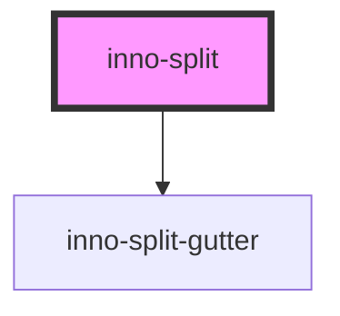

# inno-split

<!-- Auto Generated Below -->

## Overview

Experimental component that lets the user separate and resize panels. Should only contain inno-split-item children components.
The inno-split-item components can contain inno-split component for nesting.

## Properties

| Property                 | Attribute     | Description                                                                                                                                        | Type                         | Default        |
| ------------------------ | ------------- | -------------------------------------------------------------------------------------------------------------------------------------------------- | ---------------------------- | -------------- |
| `orientation`            | `orientation` |                                                                                                                                                    | `"horizontal" \| "vertical"` | `'horizontal'` |
| `slotNames` _(required)_ | --            | Required property. Unique slot names for the inno-split-items to insert into. Length must be equal to the number of inserted inno-split-items.     | `string[]`                   | `undefined`    |
| `splitAreasDefaultSizes` | --            | Default size of each contained inno-split-item in percentage (width if 'horizontal', height if 'vertical'). If omitted they will have equal sizes. | `number[]`                   | `[]`           |

## Methods

### `reInit() => Promise<void>`

Reinit the component. Can be used if the number of inno-split-items change.

#### Returns

Type: `Promise<void>`

## Dependencies

### Depends on

- [inno-split-gutter](../inno-split-gutter)

### Graph

----------------------------------------------

*Built with [StencilJS](https://stenciljs.com/)*
