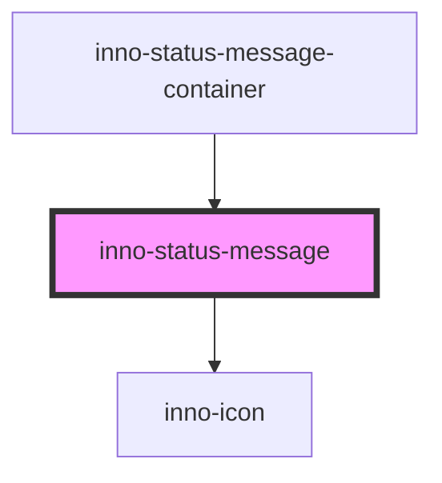

import Tabs from '@theme/Tabs';
import TabItem from '@theme/TabItem';
import {InnoStatusMessage} from '@innomotics/brand-experience-react-lib';
import InnoStatusMessageExample from '@site/src/components/InnoStatusMessageExample/InnoStatusMessageExample'

# inno-status-message

<Tabs>
  <TabItem value="preview" label="Preview" default>
  <div class="component-display">
    <div class="dark-bg component-display columns">
      <span class="bg-title">status message example</span>
      <InnoStatusMessageExample></InnoStatusMessageExample>
    </div>
  </div>

  <div class="component-display">
    <div class="light-bg component-display columns">
      <span class="bg-title">light background</span>
      <InnoStatusMessage theme="light" messageType="info"><span>Status message</span></InnoStatusMessage>
      <InnoStatusMessage theme="light" messageType="success"><span>Status message</span></InnoStatusMessage>
      <InnoStatusMessage theme="light" messageType="warning"><span>Status message</span></InnoStatusMessage>
      <InnoStatusMessage theme="light" messageType="error"><span>Status message</span></InnoStatusMessage>
    </div>
  </div>
  <div class="component-display">
    <div class="dark-bg component-display columns">
      <span class="bg-title">dark background</span>
      <InnoStatusMessage theme="dark" messageType="info" showProgess><span>Status message</span></InnoStatusMessage>
      <InnoStatusMessage theme="dark" messageType="success"><span>Status message</span></InnoStatusMessage>
      <InnoStatusMessage theme="dark" messageType="warning"><span>Status message</span></InnoStatusMessage>
      <InnoStatusMessage theme="dark" messageType="error"><span>Status message</span></InnoStatusMessage>
    </div>
  </div>
  </TabItem>
  <TabItem value="overview" label="Overview" default>
  <div class="component-display">
    <div class="dark-bg component-display columns">
      <span class="bg-title-big">Overview</span>

      General information about the status message component.

      <span class="bg-title-big">Usage</span>

      The framework specific API should be used show the status messages.

      <span class="bg-title-big">Common API</span>

      ```ts
        type InnoStatusMessageType = 'info' | 'success' | 'warning' | 'error';

        type InnoStatusMessagePosition = 'top-right' | 'bottom-right' | 'bottom-left' | 'top-left';

        type InnoStatusMessageTheme = 'light' | 'dark';
      ```

      ```ts
        /**
         * Status message configuration.
         */
        export interface InnoStatusMessageConfig {
          /**
           * Content of the status message.
           */
          message: string | HTMLElement;

          /**
           * Type of the message.
           */
          type?: InnoStatusMessageType;

          /**
           * Theme of the message.
           */
          theme?: InnoStatusMessageTheme;

          /**
           * Should close the message automatically.
           */
          autoClose?: boolean;

          /**
           * When to close the message.
           * Applied to the autoClose and showProgress properties.
           */
          autoCloseDelay?: number;

          /**
           * Show the progress bar.
           */
          showProgress?: boolean;

          /**
           * Override the icon.
           */
          icon?: string;

          /**
           * Override the color of the icon.
           */
          iconColor?: string;

          /**
           * Position of the message on the screen.
           */
          position?: InnoStatusMessagePosition;
        }
      ```

    </div>

  </div>
  </TabItem>
  <TabItem value="Angular" label="Angular">
  <Tabs>
    <TabItem value="angular-configuration" label="Configuration" default>
      <div class="component-display">
        <div class="dark-bg">
        <span class="bg-title-big">Configuration</span>
        
        Import the provided module into the application root module.

        Module example:

        ```ts
          import { ComponentsModule } from '@innomotics/brand-experience-angular-lib';

          @NgModule({
            imports: [
              // Import the components
              ComponentsModule,

              // Import the service
              ComponentsModule.forRoot(),
            ]
          })
          export class ApplicationRootModule {}
        ```

        Standalone component example:

        ```ts
        import { ComponentsModule } from '@innomotics/brand-experience-angular-lib';

        bootstrapApplication(PhotoAppComponent, {
          providers: [
            importProvidersFrom(
              ComponentsModule.forRoot()
            ),
          ]
        });

        ```
        </div>
      </div>
    </TabItem>
    <TabItem value="angular-api" label="API">
      <div class="component-display">
        <div class="dark-bg">
        <span class="bg-title-big">Description of the API surface</span>

        Overview about the core API.

        <span class="bg-title-big">InnoModalService</span>

        Central service to open status messages.

        ```ts
          class StatusMessageService {
            setPosition(position: InnoStatusMessagePosition): Promise<void>

            getPosition(): Promise<InnoStatusMessagePosition>

            show(config: StatusMessageConfig): Promise<ShowStatusMessageResult>
          }
        ```
        <span class="bg-title-big">Usage</span>

        Inject into a component and use the `show` method to show a status message.

        <span class="bg-title-big">Methods</span>

        <span class="bg-title-big">`show`</span>

        Show a new status message.

        **Parameters**

        | Name      | Type                  | Description                  |
        | --------- | --------------------- | ---------------------------- |
        | `config`    | StatusMessageConfig | Message configuration object |

        **Returns:**

        Type: `Promise<ShowStatusMessageResult>`

        A reference to the created message instance.

        <span class="bg-title-big">`setPosition`</span>

        Set the position of the status messages.

        **Parameters**

        | Name       | Type                      | Description                  |
        | ---------- | ------------------------- | ---------------------------- |
        | `position` | InnoStatusMessagePosition | Position of the messages     |

        **Returns:**

        Type: `Promise<void>`

        <span class="bg-title-big">`getPosition`</span>

        Get the position of the status messages.

        **Returns:**

        Type: `Promise<InnoStatusMessagePosition>`

        <span class="bg-title-big">StatusMessageConfig</span>

        Configuration of the opened message instance.

        Same as the inno-status-message configuration but the content can be a `TemplateRef` or a string.

        | Name       | Type            | Description                   |
        | ---------- | --------------- | ----------------------------- |
        | `content`  | `TemplateRef`   | Reference to an `ng-template` |
        | `content`  | `string`        | Text message to show          |

        <span class="bg-title-big">ShowStatusMessageResult</span>

        Reference to the created message instance.

        ```ts
          type ShowStatusMessageResult = {
              onClose: TypedEvent<any | undefined>;
              close: (result?: any) => void;
          };
        ```

        **Properties**

        | Name          | Type                   | Description                               |
        | ------------- | ---------------------- | ----------------------------------------- |
        | `onClose`     | `TypedEvent<TReason>`  | Close event subscription handler          |
        | `close`       | `TypedEvent<TReason>`  | Close the message                         |

        </div>
      </div>
    </TabItem>
    <TabItem value="angular-usage" label="Usage">
      <div class="component-display">
        <div class="dark-bg">

        Import the service and call the `show` method to show a new status message.

        The returned reference can be used to manage the message.

        ```ts
        @Component({})
        export class GeneralComponent {
          constructor(private messageService: StatusMessageService) {}

          async showStatusMessage() {
            const ref = await this.messageService.show({
              message: 'my message',
              theme: 'dark',
              type: 'warning',
              position: 'top-left',
              autoClose: false,
              autoCloseDelay: 1000,
              showProgress: true,
            });

            // message can be closed explicitly, example timeout close
            setTimeout(() => ref.close('cause'), 2000);
          }
        }
        ```
        </div>
      </div>
    </TabItem>

  </Tabs>
  </TabItem>
  <TabItem value="React" label="React">
    <div class="component-display">
    <div class="dark-bg">
      <span class="bg-title">Use the provided function to show status message.</span>

      ```tsx
      export function InnoStatusMessageExample() {
        return (
          <>
            <InnoButton
              onClick={() => {
                showStatusMessage({
                  message: "My toast message!",
                  showProgress: true,
                  theme: "dark",
                  type: "success",
                });
              }}
            >
              Trigger status message
            </InnoButton>
          </>
        );
      }
      ```
    </div>

  </div>
  </TabItem>
    <TabItem value="Vue" label="Vue">
    ```js
    <div class="component-display">
    <div class="light-bg">
      <span class="bg-title">light background</span>
    </div>
    <div class="dark-bg">
      <span class="bg-title">dark background</span>
    </div>
  </div>
    ```
  </TabItem>
</Tabs>

<!-- Auto Generated Below -->


## Overview

Represents a status message entry.

## Properties

| Property         | Attribute          | Description                                                                                                           | Type                                          | Default     |
| ---------------- | ------------------ | --------------------------------------------------------------------------------------------------------------------- | --------------------------------------------- | ----------- |
| `autoClose`      | `auto-close`       | Autoclose message after the given delay. The message will be closed independently from showProgress property.         | `boolean`                                     | `false`     |
| `autoCloseDelay` | `auto-close-delay` | Autoclose delay.                                                                                                      | `number`                                      | `3000`      |
| `icon`           | `icon`             | Icon of toast                                                                                                         | `string`                                      | `undefined` |
| `iconColor`      | `icon-color`       | Icon color of toast                                                                                                   | `string`                                      | `undefined` |
| `messageType`    | `message-type`     | Type of the status message.                                                                                           | `"error" \| "info" \| "success" \| "warning"` | `'info'`    |
| `showProgress`   | `show-progress`    | Animate progressbar and close after animation ends. The message will be closed independently from autoClose property. | `boolean`                                     | `false`     |
| `theme`          | `theme`            | Theme variant of the component.                                                                                       | `"dark" \| "light"`                           | `'light'`   |


## Events

| Event          | Description               | Type               |
| -------------- | ------------------------- | ------------------ |
| `closeMessage` | Status message is closed. | `CustomEvent<any>` |


## Dependencies

### Used by

 - inno-status-message-container

### Depends on

- [inno-icon](../../inno-icon)

### Graph


----------------------------------------------

*Built with [StencilJS](https://stenciljs.com/)*
