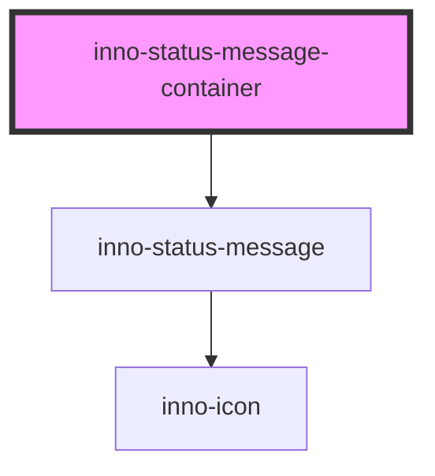

# inno-status-message-container

<!-- Auto Generated Below -->

## Overview

Container to hold the status messages.

## Properties

| Property         | Attribute         | Description                   | Type                                                           | Default                      |
| ---------------- | ----------------- | ----------------------------- | -------------------------------------------------------------- | ---------------------------- |
| `containerClass` | `container-class` | Customizable container class. | `string`                                                       | `'status-message-container'` |
| `containerId`    | `container-id`    | Customizable container id.    | `string`                                                       | `'status-message-container'` |
| `position`       | `position`        | Position of container.        | `"bottom-left" \| "bottom-right" \| "top-left" \| "top-right"` | `'top-right'`                |

## Methods

### `showStatusMessage(config: InnoStatusMessageConfig) => Promise<ShowStatusMessageResult>`

Display a toast message

#### Parameters

| Name     | Type                      | Description |
| -------- | ------------------------- | ----------- |
| `config` | `InnoStatusMessageConfig` |             |

#### Returns

Type: `Promise<ShowStatusMessageResult>`

## Dependencies

### Depends on

- [inno-status-message](.)

### Graph

----------------------------------------------

*Built with [StencilJS](https://stenciljs.com/)*
