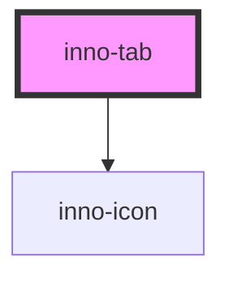

import Tabs from '@theme/Tabs';
import TabItem from '@theme/TabItem';
import {InnoTab, InnoTabItem} from '@innomotics/brand-experience-react-lib';

# inno-tab

<Tabs>
  <TabItem value="preview" label="Preview" default>
  <div class="component-display">
    <div class="light-bg">
      <span class="bg-title">light background, layout stretched</span>
      <InnoTab theme="light" layout="stretched">
        <InnoTabItem>High emphasis item</InnoTabItem>
        <InnoTabItem>Device overview</InnoTabItem>
        <InnoTabItem>Device details</InnoTabItem>
      </InnoTab>
    </div>
  </div>

  <div class="component-display" style={{display: 'block'}}>
    <div class="light-bg">
      <span class="bg-title">light background, layout auto</span>
      <InnoTab theme="light" layout="auto">
        <InnoTabItem>Tab label 1</InnoTabItem><InnoTabItem>Tab label 2</InnoTabItem><InnoTabItem>Tab label 3</InnoTabItem>
        <InnoTabItem>Tab label 4</InnoTabItem><InnoTabItem>Tab label 5</InnoTabItem><InnoTabItem>Tab label 6</InnoTabItem>
        <InnoTabItem>Tab label 7</InnoTabItem><InnoTabItem>Tab label 8</InnoTabItem><InnoTabItem>Tab label 9</InnoTabItem>
        <InnoTabItem>Tab label 10</InnoTabItem><InnoTabItem>Tab label 11</InnoTabItem><InnoTabItem>Tab label 12</InnoTabItem>
        <InnoTabItem>Tab label 13</InnoTabItem><InnoTabItem>Tab label 14</InnoTabItem><InnoTabItem>Tab label 15</InnoTabItem>
      </InnoTab>
    </div>
  </div>

  <div class="component-display">
    <div class="dark-bg">
      <span class="bg-title">dark background, layout stretched</span>
      <InnoTab theme="dark" layout="stretched">
        <InnoTabItem>High emphasis item</InnoTabItem>
        <InnoTabItem>Device overview</InnoTabItem>
        <InnoTabItem>Device details</InnoTabItem>
      </InnoTab>
    </div>
  </div>

  <div class="component-display" style={{display: 'block'}}>
    <div class="dark-bg">
      <span class="bg-title">dark background, layout auto</span>
      <InnoTab theme="dark" layout="auto">
        <InnoTabItem>Tab label 1</InnoTabItem><InnoTabItem>Tab label 2</InnoTabItem><InnoTabItem>Tab label 3</InnoTabItem>
        <InnoTabItem>Tab label 4</InnoTabItem><InnoTabItem>Tab label 5</InnoTabItem><InnoTabItem>Tab label 6</InnoTabItem>
        <InnoTabItem>Tab label 7</InnoTabItem><InnoTabItem>Tab label 8</InnoTabItem><InnoTabItem>Tab label 9</InnoTabItem>
        <InnoTabItem>Tab label 10</InnoTabItem><InnoTabItem>Tab label 11</InnoTabItem><InnoTabItem>Tab label 12</InnoTabItem>
        <InnoTabItem>Tab label 13</InnoTabItem><InnoTabItem>Tab label 14</InnoTabItem><InnoTabItem>Tab label 15</InnoTabItem>
      </InnoTab>
    </div>
  </div>
  </TabItem>
  <TabItem value="angular" label="Angular">
    ```html
      <inno-tab [layout]="layout" [theme]="theme" [selected]="selectedTabIndex" (selectedChange)="handleTabChange($event.detail)">
        <inno-tab-item>Tab item 1</inno-tab-item>
        <inno-tab-item>Tab item 2</inno-tab-item>
        <inno-tab-item>Tab item 3</inno-tab-item>
      </inno-tab>

      <!-- Tab content container -->
      <div *ngIf="activeTabIndex === 0">Tab 1 active</div>
      <div *ngIf="activeTabIndex === 1">Tab 2 active</div>
      <div *ngIf="activeTabIndex === 2">Tab 3 active</div>
    ```

    ```ts
      class Component {
        selectedTabIndex: number = 1;

        handleTabChange(index: number) {
          this.activeTabIndex = index;
        }
      }
    ```

  </TabItem>
  <TabItem value="react" label="React">
    ```tsx
      import {InnoTab, InnoTabItem} from '@innomotics/brand-experience-react-lib';
      import { useState } from 'react';

      export default () => {
        const [selectedTab, setSelectedTab] = useState(0);

        const changeTab = (tabId: number) => setSelectedTab(tabId);

        return (
          <div>
            <InnoTab selected={selectedTab} onSelectedChange={event => changeTab(event.detail)}>
              <InnoTabItem>Tab 1</InnoTabItem>
              <InnoTabItem>Tab 2</InnoTabItem>
              <InnoTabItem>Tab 3</InnoTabItem>
            </InnoTab>
            {selectedTab === 0 ? <div>Content 1</div> : null}
            {selectedTab === 1 ? <div>Content 2</div> : null}
            {selectedTab === 2 ? <div>Content 3</div> : null}
          </div>
        );
      };
    ```

  </TabItem>
  <TabItem value="vue" label="Vue">
    ```ts
      <script setup lang="ts">
        import { InnoTab, InnoTabItem } from '@innomotics/brand-experience-vue-lib';
        import { ref } from 'vue';

        const selectedTab = ref(0);
        const changeTab = (tabId: number) => (selectedTab.value = tabId);
      </script>

      <template>
        <div>
          <InnoTab :selected="selectedTab">
            <InnoTabItem @click="changeTab(0)">Tab 1</InnoTabItem>
            <InnoTabItem @click="changeTab(1)">Tab 2</InnoTabItem>
            <InnoTabItem @click="changeTab(2)">Tab 3</InnoTabItem>
          </InnoTab>
          <div v-show="selectedTab === 0">Content 1</div>
          <div v-show="selectedTab === 1">Content 2</div>
          <div v-show="selectedTab === 2">Content 3</div>
        </div>
      </template>
    ```

  </TabItem>
</Tabs>

<!-- Auto Generated Below -->


## Properties

| Property    | Attribute    | Description                            | Type                    | Default   |
| ----------- | ------------ | -------------------------------------- | ----------------------- | --------- |
| `layout`    | `layout`     | Set layout width style                 | `"auto" \| "stretched"` | `'auto'`  |
| `selected`  | `selected`   | Set default selected tab by index      | `number`                | `0`       |
| `showArrow` | `show-arrow` | Show the navigation arrow for desktop. | `boolean`               | `true`    |
| `theme`     | `theme`      | Theme variant of the component.        | `"dark" \| "light"`     | `'light'` |


## Events

| Event            | Description                 | Type                  |
| ---------------- | --------------------------- | --------------------- |
| `selectedChange` | `selected` property changed | `CustomEvent<number>` |


## Dependencies

### Depends on

- [inno-icon](../inno-icon)

### Graph


----------------------------------------------

*Built with [StencilJS](https://stenciljs.com/)*
