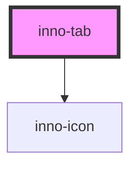

import Tabs from '@theme/Tabs';
import TabItem from '@theme/TabItem';
import {InnoTab, InnoTabItem} from '@innomotics/ix-react-lib';

# inno-tab

<Tabs>
  <TabItem value="preview" label="Preview (dark)" default>
    

    <InnoTab>
      <InnoTabItem>High emphasis item</InnoTabItem>
      <InnoTabItem>Device details</InnoTabItem>
      <InnoTabItem>Device details</InnoTabItem>
    </InnoTab>
    

  </TabItem>
</Tabs>

<!-- Auto Generated Below -->

## Properties

| Property    | Attribute    | Description                            | Type                    | Default   |
| ----------- | ------------ | -------------------------------------- | ----------------------- | --------- |
| `layout`    | `layout`     | Set layout width style                 | `"auto" \| "stretched"` | `'auto'`  |
| `selected`  | `selected`   | Set default selected tab by index      | `number`                | `0`       |
| `showArrow` | `show-arrow` | Show the navigation arrow for desktop. | `boolean`               | `true`    |
| `theme`     | `theme`      |                                        | `"dark" \| "light"`     | `'light'` |

## Events

| Event            | Description                 | Type                  |
| ---------------- | --------------------------- | --------------------- |
| `selectedChange` | `selected` property changed | `CustomEvent<number>` |

## Dependencies

### Depends on

- [inno-icon](../inno-icon)

### Graph

----------------------------------------------

*Built with [StencilJS](https://stenciljs.com/)*
