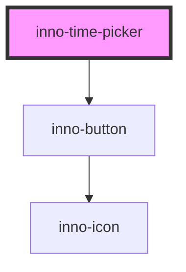

# inno-time-picker

<!-- Auto Generated Below -->

## Properties

| Property | Attribute | Description                     | Type                  | Default      |
| -------- | --------- | ------------------------------- | --------------------- | ------------ |
| `format` | `format`  | Date format string.             | `string`              | `'HH:mm:ss'` |
| `texts`  | --        | Component text configuration.   | `InnoTimePickerTexts` | `undefined`  |
| `theme`  | `theme`   | Theme variant of the component. | `"dark" \| "light"`   | `'light'`    |
| `time`   | `time`    |                                 | `string`              | `undefined`  |

## Events

| Event         | Description | Type               |
| ------------- | ----------- | ------------------ |
| `valueChange` |             | `CustomEvent<any>` |

## Dependencies

### Depends on

- [inno-button](../inno-button)

### Graph

----------------------------------------------

*Built with [StencilJS](https://stenciljs.com/)*
